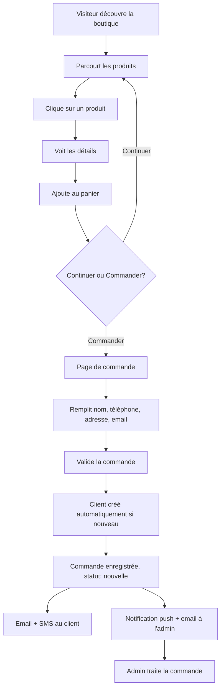
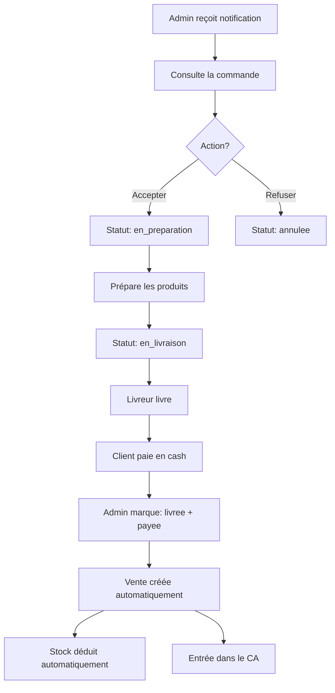

# Module Boutique en Ligne - Plan d'Implémentation Détaillé

> **📱 Optimisé pour le partage social et l'expérience mobile**  
> Ce document décrit l'implémentation complète d'un module de boutique en ligne moderne avec :
> - ✅ Liens uniques partageables (boutique + produits)
> - ✅ Optimisation Facebook/WhatsApp/Instagram avec meta tags Open Graph
> - ✅ Design ultra moderne, intuitif et ergonomique
> - ✅ Responsive mobile-first (téléphone, tablette, desktop)
> - ✅ Boutons de partage intégrés sur toutes les pages
> - ✅ Animations fluides et interactions modernes

## 📋 Table des matières

1. [Vue d'ensemble](#1-vue-densemble)
2. [Analyse de l'architecture existante](#2-analyse-de-larchitecture-existante)
3. [Architecture du module boutique](#3-architecture-du-module-boutique)
4. [Modèles de données](#4-modèles-de-données)
5. [Migrations de base de données](#5-migrations-de-base-de-données)
6. [Routes et contrôleurs](#6-routes-et-contrôleurs)
7. [Vues et interfaces](#7-vues-et-interfaces)
8. [Système de commandes](#8-système-de-commandes)
9. [Notifications et emails](#9-notifications-et-emails)
10. [Intégration avec les ventes](#10-intégration-avec-les-ventes)
11. [Sécurité et validation](#11-sécurité-et-validation)
12. [Tests](#12-tests)
13. [Plan de déploiement](#13-plan-de-déploiement)
14. [Évolutions futures](#14-évolutions-futures)
15. [Guide du partage social](#15-guide-du-partage-social)

---

## 📱 Aperçu rapide : Partage social et UX

### Liens uniques partageables

**Boutique d'un établissement :**
```
https://maelya.com/shop/salon-elegance-yaounde
```
✅ Slug unique par établissement (basé sur le nom)  
✅ URL courte et mémorisable  
✅ Permanente (ne change jamais)  
✅ Optimisée SEO

**Produit spécifique :**
```
https://maelya.com/shop/salon-elegance-yaounde/produit/9a5f7c3e-uuid
```
✅ Lien direct vers un produit  
✅ Partage facile par WhatsApp, Facebook, Instagram  
✅ Prévisualisation riche (image + prix + nom)

### Ce qui s'affiche quand on partage

**Sur WhatsApp / Facebook / Instagram :**
```
┌─────────────────────────────────┐
│ [Image du produit/logo]         │
│                                 │
│ Shampoing Bio Premium           │
│ 15 000 FCFA                     │
│                                 │
│ Salon Élégance - Yaoundé        │
│ Commandez en ligne              │
└─────────────────────────────────┘
```

### Boutons de partage intégrés

Sur chaque page boutique et produit :
- 🟢 **WhatsApp** : Partage instantané avec texte pré-rempli
- 🔵 **Facebook** : Post automatique avec aperçu
- 📋 **Copier le lien** : Pour Instagram stories, SMS, email

### Design moderne et responsive

**Mobile (< 640px) :**
- Interface tactile optimisée
- Boutons larges (min 44x44px)
- Navigation intuitive
- Panier flottant avec badge
- Formulaire simplifié

**Tablette (768px - 1024px) :**
- Grille adaptée (2-3 produits par ligne)
- Espacement optimal
- Navigation latérale

**Desktop (> 1280px) :**
- Grille 4 colonnes
- Détails enrichis
- Hover effects élégants

---

## 1. Vue d'ensemble

### 1.1 Objectif du module

Permettre à chaque établissement inscrit sur Maëlya Gestion d'avoir sa propre **boutique en ligne** pour vendre ses produits directement aux clients, avec :
- Navigation publique sans connexion
- Panier d'achat dynamique
- Commandes avec livraison cash
- Gestion des commandes dans le dashboard
- Notifications push et email
- Intégration automatique dans le chiffre d'affaires

### 1.2 Fonctionnalités principales

**Pour les visiteurs/clients :**
- ✅ Parcourir le catalogue de produits
- ✅ Voir les détails d'un produit (photo, description, prix, stock)
- ✅ Ajouter des produits au panier
- ✅ Passer commande sans créer de compte
- ✅ Recevoir un email de confirmation
- ✅ Suivre le statut de sa commande (via lien)

**Pour l'établissement (dashboard) :**
- ✅ Activer/désactiver la boutique en ligne
- ✅ Configurer les paramètres (zones de livraison, frais, délais)
- ✅ Recevoir les notifications de nouvelles commandes
- ✅ Gérer les commandes (statuts : nouvelle, en préparation, en livraison, livrée, annulée)
- ✅ Marquer une commande comme payée → entrée automatique dans le CA
- ✅ Voir l'historique complet des commandes

### 1.3 Contraintes initiales

- **Paiement** : Cash à la livraison uniquement (V1)
- **Authentification** : Aucun compte requis pour le client
- **Stock** : Vérification en temps réel lors de la commande
- **Gestion** : Commandes traitées manuellement par l'admin

### 1.4 Exigences de partage et UX

**Liens uniques partageables :**
- ✅ Chaque établissement a un lien unique permanent : `/shop/{slug}`
- ✅ Chaque produit a un lien unique permanent : `/shop/{slug}/produit/{id}`
- ✅ Les liens sont optimisés pour le partage sur les réseaux sociaux (Facebook, WhatsApp, Instagram)
- ✅ Meta tags Open Graph pour un aperçu riche lors du partage
- ✅ Boutons de partage intégrés sur chaque page

**Design et expérience utilisateur :**
- ✅ **Design ultra moderne** : Interface épurée, animations fluides, transitions douces
- ✅ **Intuitif** : Navigation claire, call-to-action visibles, processus de commande simplifié
- ✅ **Ergonomique** : Boutons bien dimensionnés, espacement optimal, hiérarchie visuelle claire
- ✅ **Responsive** : Adapté mobile-first, parfait sur téléphone, tablette et desktop
- ✅ **Performance** : Chargement rapide, images optimisées, lazy loading
- ✅ **Accessibilité** : Contraste suffisant, navigation au clavier, textes alternatifs

---

## 2. Analyse de l'architecture existante

### 2.1 Modèles pertinents

#### Institut
```php
// app/Models/Institut.php
- Champs existants : id, nom, slug, email, telephone, ville, type, logo, actif
- Champs pour vitrine : vitrine_active (boolean), reservation_en_ligne (boolean)
- Relations : users, prestations, produits, clients, ventes
```

**✅ Point fort** : Le système de vitrine existe déjà (`vitrine_active`). On peut utiliser la même logique pour activer la boutique.

#### Produit
```php
// app/Models/Produit.php
- Champs : nom, reference, code_barre, prix_achat, prix_vente, stock, seuil_alerte, unite, description, photo, actif
- Relations : categorie, mouvementsStock
- Gestion du stock avec CMP (Coût Moyen Pondéré)
```

**✅ Point fort** : Le modèle produit est complet avec gestion de stock. Parfait pour la boutique.

#### Client
```php
// app/Models/Client.php
- Champs : prenom, nom, telephone, email, adresse, piece_identite, date_naissance, notes, points_fidelite
- Relations : ventes, credits, rdvs
- Token de fidélité pour QR code
```

**✅ Point fort** : Le modèle Client existe et peut être réutilisé. On créera automatiquement un client lors de la commande.

#### Vente & VenteItem
```php
// app/Models/Vente.php
- Champs : numero, numero_facture, total, montant_paye, remise, pourboire, mode_paiement, statut
- Modes de paiement : cash, mobile_money, carte, mixte, credit
- Statuts : validee, annulee
- Relations : client, user (vendeur), items, codeReduction, avoirs

// app/Models/VenteItem.php
- Champs : type (prestation/produit/libre), item_id, nom_snapshot, prix_snapshot, quantite, sous_total
```

**✅ Point fort** : Le système de ventes est robuste. On peut créer une vente depuis une commande payée.

### 2.2 Système de notifications existant

```php
// app/Services/NotificationService.php
- notifyUser() : notification base de données
- notifyAdmins() : notification pour tous les super_admins

// app/Services/PushNotificationService.php
- Gestion des push notifications web
```

**✅ Point fort** : Infrastructure de notifications déjà en place.

### 2.3 Système de mails existant

Emails existants :
- `NouveauRdvVitrineClient.php` : Email envoyé au client après réservation vitrine
- `NouveauRdvVitrineEtablissement.php` : Email envoyé à l'établissement

**✅ Point fort** : On peut créer des emails similaires pour les commandes.

### 2.4 Routes publiques existantes

```php
// routes/web.php
- GET /e/{slug} : Vitrine publique de l'établissement
- POST /e/{slug}/reserver : Réservation depuis la vitrine
- GET /ticket/{id} : Ticket PDF public
```

**✅ Point fort** : Pattern déjà établi pour les pages publiques avec slug.

---

## 3. Architecture du module boutique

### 3.1 Structure des URLs

**Pages publiques (boutique) :**
```
/shop/{slug}                    → Page principale de la boutique
/shop/{slug}/produit/{id}       → Détails d'un produit
/shop/{slug}/commande           → Page de commande (checkout)
/shop/{slug}/commande/{numero}  → Confirmation + suivi de commande
```

**Exemples de liens partageables :**
- Boutique : `https://maelya.com/shop/salon-elegance-yaounde`
- Produit : `https://maelya.com/shop/salon-elegance-yaounde/produit/abc123-uuid`

**Caractéristiques des liens :**
- ✅ URLs courtes et lisibles
- ✅ Slug descriptif pour le SEO
- ✅ Permanents (ne changent jamais)
- ✅ Optimisés pour le partage social
- ✅ Prévisualisables sur Facebook, WhatsApp, Instagram

**Pages dashboard (gestion) :**
```
/dashboard/boutique/config               → Activation et configuration
/dashboard/boutique/commandes            → Liste des commandes
/dashboard/boutique/commandes/{id}       → Détails d'une commande
/dashboard/boutique/commandes/{id}/update → Mise à jour du statut
```

### 3.2 Flux utilisateur (client)



### 3.3 Flux administrateur (gestion)



---

## 4. Modèles de données

### 4.1 Nouveau modèle : Commande

```php
<?php
// app/Models/Commande.php

namespace App\Models;

use App\Traits\BelongsToInstitut;
use Illuminate\Database\Eloquent\Concerns\HasUuids;
use Illuminate\Database\Eloquent\Model;

class Commande extends Model
{
    use HasUuids, BelongsToInstitut;

    protected $fillable = [
        'institut_id',
        'client_id',           // Lien vers le client (créé automatiquement)
        'numero',              // Format: CMD-XXXXXXXX
        'vente_id',            // Lien vers la vente (null jusqu'au paiement)
        
        // Informations client (snapshot au moment de la commande)
        'client_nom',
        'client_prenom',
        'client_telephone',
        'client_email',
        'client_adresse',
        
        // Montants
        'sous_total',          // Total produits
        'frais_livraison',     // Frais de livraison
        'total',               // sous_total + frais_livraison
        
        // Statut de la commande
        'statut',              // Enum: nouvelle, acceptee, en_preparation, en_livraison, livree, annulee, refusee
        
        // Dates importantes
        'acceptee_le',
        'preparee_le',
        'expediee_le',
        'livree_le',
        'annulee_le',
        
        // Paiement
        'payee',               // Boolean
        'payee_le',
        
        // Notes
        'notes_client',        // Notes du client lors de la commande
        'notes_admin',         // Notes internes de l'admin
        'motif_annulation',    // Si annulée ou refusée
        
        // Tracking
        'ip_address',
        'user_agent',
    ];

    protected $casts = [
        'sous_total' => 'integer',
        'frais_livraison' => 'integer',
        'total' => 'integer',
        'payee' => 'boolean',
        'acceptee_le' => 'datetime',
        'preparee_le' => 'datetime',
        'expediee_le' => 'datetime',
        'livree_le' => 'datetime',
        'annulee_le' => 'datetime',
        'payee_le' => 'datetime',
    ];

    protected static function boot(): void
    {
        parent::boot();
        static::creating(function ($model) {
            if (empty($model->numero)) {
                $model->numero = 'CMD-' . strtoupper(\Illuminate\Support\Str::random(8));
            }
        });
    }

    // Relations
    public function institut()
    {
        return $this->belongsTo(Institut::class);
    }

    public function client()
    {
        return $this->belongsTo(Client::class);
    }

    public function items()
    {
        return $this->hasMany(CommandeItem::class);
    }

    public function vente()
    {
        return $this->belongsTo(Vente::class);
    }

    // Scopes
    public function scopeEnCours($query)
    {
        return $query->whereIn('statut', ['nouvelle', 'acceptee', 'en_preparation', 'en_livraison']);
    }

    public function scopeTerminees($query)
    {
        return $query->whereIn('statut', ['livree', 'annulee', 'refusee']);
    }

    public function scopeNonPayees($query)
    {
        return $query->where('payee', false);
    }

    // Helpers
    public function estModifiable(): bool
    {
        return in_array($this->statut, ['nouvelle', 'acceptee', 'en_preparation']);
    }

    public function estAnnulable(): bool
    {
        return in_array($this->statut, ['nouvelle', 'acceptee', 'en_preparation']);
    }

    public function peutEtreMarqueePayee(): bool
    {
        return $this->statut === 'livree' && !$this->payee;
    }
}
```

### 4.2 Nouveau modèle : CommandeItem

```php
<?php
// app/Models/CommandeItem.php

namespace App\Models;

use Illuminate\Database\Eloquent\Concerns\HasUuids;
use Illuminate\Database\Eloquent\Model;

class CommandeItem extends Model
{
    use HasUuids;

    protected $table = 'commande_items';

    protected $fillable = [
        'commande_id',
        'produit_id',          // Lien vers le produit
        
        // Snapshot au moment de la commande (prix peut changer après)
        'nom_snapshot',
        'reference_snapshot',
        'prix_snapshot',
        
        'quantite',
        'sous_total',          // prix_snapshot * quantite
    ];

    protected $casts = [
        'prix_snapshot' => 'integer',
        'quantite' => 'integer',
        'sous_total' => 'integer',
    ];

    // Relations
    public function commande()
    {
        return $this->belongsTo(Commande::class);
    }

    public function produit()
    {
        return $this->belongsTo(Produit::class);
    }
}
```

### 4.3 Modification du modèle Institut

```php
// Ajouter dans app/Models/Institut.php

protected $fillable = [
    // ... existants
    'boutique_active',           // Boolean - Activer/désactiver la boutique
    'boutique_frais_livraison', // Integer - Frais de livraison par défaut
    'boutique_zones_livraison', // JSON - Zones de livraison avec tarifs
    'boutique_delai_livraison', // String - Délai indicatif (ex: "24-48h")
    'boutique_conditions',       // Text - Conditions de vente
];

protected $casts = [
    // ... existants
    'boutique_active' => 'boolean',
    'boutique_frais_livraison' => 'integer',
    'boutique_zones_livraison' => 'array',
];

// Relations
public function commandes()
{
    return $this->hasMany(Commande::class);
}
```

---

## 5. Migrations de base de données

### 5.1 Migration : Ajouter les champs boutique à la table instituts

```php
<?php
// database/migrations/2026_07_07_000001_add_boutique_fields_to_instituts_table.php

use Illuminate\Database\Migrations\Migration;
use Illuminate\Database\Schema\Blueprint;
use Illuminate\Support\Facades\Schema;

return new class extends Migration
{
    public function up(): void
    {
        Schema::table('instituts', function (Blueprint $table) {
            $table->boolean('boutique_active')->default(false)->after('reservation_en_ligne');
            $table->integer('boutique_frais_livraison')->default(0)->after('boutique_active');
            $table->json('boutique_zones_livraison')->nullable()->after('boutique_frais_livraison');
            $table->string('boutique_delai_livraison', 100)->nullable()->after('boutique_zones_livraison');
            $table->text('boutique_conditions')->nullable()->after('boutique_delai_livraison');
        });
    }

    public function down(): void
    {
        Schema::table('instituts', function (Blueprint $table) {
            $table->dropColumn([
                'boutique_active',
                'boutique_frais_livraison',
                'boutique_zones_livraison',
                'boutique_delai_livraison',
                'boutique_conditions',
            ]);
        });
    }
};
```

### 5.2 Migration : Créer la table commandes

```php
<?php
// database/migrations/2026_07_07_000002_create_commandes_table.php

use Illuminate\Database\Migrations\Migration;
use Illuminate\Database\Schema\Blueprint;
use Illuminate\Support\Facades\Schema;

return new class extends Migration
{
    public function up(): void
    {
        Schema::create('commandes', function (Blueprint $table) {
            $table->uuid('id')->primary();
            $table->uuid('institut_id');
            $table->uuid('client_id')->nullable(); // Peut être null temporairement
            $table->uuid('vente_id')->nullable();  // Lien vers la vente (null jusqu'au paiement)
            
            $table->string('numero', 50)->unique();
            
            // Informations client (snapshot)
            $table->string('client_nom', 80);
            $table->string('client_prenom', 80);
            $table->string('client_telephone', 30);
            $table->string('client_email', 255)->nullable();
            $table->text('client_adresse');
            
            // Montants
            $table->integer('sous_total')->default(0);
            $table->integer('frais_livraison')->default(0);
            $table->integer('total')->default(0);
            
            // Statut
            $table->enum('statut', [
                'nouvelle',
                'acceptee',
                'en_preparation',
                'en_livraison',
                'livree',
                'annulee',
                'refusee'
            ])->default('nouvelle');
            
            // Dates
            $table->timestamp('acceptee_le')->nullable();
            $table->timestamp('preparee_le')->nullable();
            $table->timestamp('expediee_le')->nullable();
            $table->timestamp('livree_le')->nullable();
            $table->timestamp('annulee_le')->nullable();
            
            // Paiement
            $table->boolean('payee')->default(false);
            $table->timestamp('payee_le')->nullable();
            
            // Notes
            $table->text('notes_client')->nullable();
            $table->text('notes_admin')->nullable();
            $table->text('motif_annulation')->nullable();
            
            // Tracking
            $table->string('ip_address', 45)->nullable();
            $table->text('user_agent')->nullable();
            
            $table->timestamps();
            
            // Index pour performances
            $table->index(['institut_id', 'created_at']);
            $table->index(['institut_id', 'statut']);
            $table->index(['client_id', 'created_at']);
            $table->index('numero');
        });
    }

    public function down(): void
    {
        Schema::dropIfExists('commandes');
    }
};
```

### 5.3 Migration : Créer la table commande_items

```php
<?php
// database/migrations/2026_07_07_000003_create_commande_items_table.php

use Illuminate\Database\Migrations\Migration;
use Illuminate\Database\Schema\Blueprint;
use Illuminate\Support\Facades\Schema;

return new class extends Migration
{
    public function up(): void
    {
        Schema::create('commande_items', function (Blueprint $table) {
            $table->uuid('id')->primary();
            $table->uuid('commande_id');
            $table->uuid('produit_id')->nullable(); // Peut devenir null si produit supprimé
            
            // Snapshot des données produit
            $table->string('nom_snapshot', 150);
            $table->string('reference_snapshot', 50)->nullable();
            $table->integer('prix_snapshot');
            
            $table->integer('quantite')->default(1);
            $table->integer('sous_total')->default(0);
            
            $table->timestamps();
            
            // Clés étrangères
            $table->foreign('commande_id')->references('id')->on('commandes')->onDelete('cascade');
            $table->foreign('produit_id')->references('id')->on('produits')->onDelete('set null');
            
            // Index
            $table->index('commande_id');
            $table->index('produit_id');
        });
    }

    public function down(): void
    {
        Schema::dropIfExists('commande_items');
    }
};
```

---

## 6. Routes et contrôleurs

### 6.1 Routes publiques (boutique)

```php
// routes/web.php

// ─── Boutique en ligne publique ──────────────────────────────────────────────
Route::prefix('shop')->name('shop.')->group(function () {
    
    // Page principale de la boutique
    Route::get('/{slug}', [\App\Http\Controllers\BoutiqueController::class, 'index'])
        ->name('index');
    
    // Détails d'un produit
    Route::get('/{slug}/produit/{produit}', [\App\Http\Controllers\BoutiqueController::class, 'produit'])
        ->name('produit');
    
    // Page de commande (checkout)
    Route::post('/{slug}/commander', [\App\Http\Controllers\BoutiqueController::class, 'commander'])
        ->middleware('throttle:10,1') // Max 10 commandes par minute
        ->name('commander');
    
    // Confirmation et suivi de commande
    Route::get('/{slug}/commande/{numero}', [\App\Http\Controllers\BoutiqueController::class, 'suivreCommande'])
        ->name('suivi');
});
```

### 6.2 Routes dashboard (gestion)

```php
// routes/web.php - Dans le groupe middleware(['auth', 'abonnement.actif'])

Route::prefix('boutique')->name('boutique.')->group(function () {
    
    // Configuration
    Route::get('/config', [\App\Http\Controllers\Dashboard\BoutiqueConfigController::class, 'index'])
        ->name('config');
    Route::post('/config', [\App\Http\Controllers\Dashboard\BoutiqueConfigController::class, 'update'])
        ->name('config.update');
    
    // Gestion des commandes
    Route::get('/commandes', [\App\Http\Controllers\Dashboard\CommandeController::class, 'index'])
        ->name('commandes.index');
    Route::get('/commandes/{commande}', [\App\Http\Controllers\Dashboard\CommandeController::class, 'show'])
        ->name('commandes.show');
    Route::post('/commandes/{commande}/statut', [\App\Http\Controllers\Dashboard\CommandeController::class, 'updateStatut'])
        ->name('commandes.statut');
    Route::post('/commandes/{commande}/paiement', [\App\Http\Controllers\Dashboard\CommandeController::class, 'marquerPayee'])
        ->name('commandes.paiement');
    Route::post('/commandes/{commande}/notes', [\App\Http\Controllers\Dashboard\CommandeController::class, 'updateNotes'])
        ->name('commandes.notes');
    Route::delete('/commandes/{commande}', [\App\Http\Controllers\Dashboard\CommandeController::class, 'destroy'])
        ->name('commandes.destroy');
});
```

### 6.3 Contrôleur : BoutiqueController (public)

```php
<?php
// app/Http/Controllers/BoutiqueController.php

namespace App\Http\Controllers;

use App\Mail\NouvelleCommandeClient;
use App\Mail\NouvelleCommandeEtablissement;
use App\Models\Client;
use App\Models\Commande;
use App\Models\CommandeItem;
use App\Models\Institut;
use App\Models\Produit;
use App\Services\NotificationService;
use App\Services\PushNotificationService;
use Illuminate\Http\Request;
use Illuminate\Support\Facades\DB;
use Illuminate\Support\Facades\Mail;

class BoutiqueController extends Controller
{
    /**
     * Page principale de la boutique
     */
    public function index(string $slug)
    {
        $institut = Institut::where('slug', $slug)
            ->where('boutique_active', true)
            ->where('actif', true)
            ->firstOrFail();

        // Charger les produits actifs avec stock disponible
        $produits = $institut->produits()
            ->where('actif', true)
            ->where('stock', '>', 0)
            ->with('categorie')
            ->orderBy('nom')
            ->get();

        // Grouper par catégorie
        $categories = $produits->groupBy(fn($p) => $p->categorie?->nom ?? 'Autres');

        return view('boutique.index', compact('institut', 'categories', 'produits'));
    }

    /**
     * Détails d'un produit
     */
    public function produit(string $slug, Produit $produit)
    {
        $institut = Institut::where('slug', $slug)
            ->where('boutique_active', true)
            ->where('actif', true)
            ->firstOrFail();

        // Vérifier que le produit appartient à cet institut
        if ($produit->institut_id !== $institut->id) {
            abort(404);
        }

        // Produits similaires (même catégorie)
        $produitsLies = Produit::where('institut_id', $institut->id)
            ->where('categorie_id', $produit->categorie_id)
            ->where('id', '!=', $produit->id)
            ->where('actif', true)
            ->where('stock', '>', 0)
            ->limit(4)
            ->get();

        return view('boutique.produit', compact('institut', 'produit', 'produitsLies'));
    }

    /**
     * Passer une commande
     */
    public function commander(Request $request, string $slug)
    {
        $institut = Institut::where('slug', $slug)
            ->where('boutique_active', true)
            ->where('actif', true)
            ->firstOrFail();

        // Validation
        $data = $request->validate([
            'prenom'    => ['required', 'string', 'max:80'],
            'nom'       => ['required', 'string', 'max:80'],
            'telephone' => ['required', 'string', 'max:30'],
            'email'     => ['nullable', 'email', 'max:255'],
            'adresse'   => ['required', 'string', 'max:500'],
            'notes'     => ['nullable', 'string', 'max:500'],
            'panier'    => ['required', 'array', 'min:1'],
            'panier.*.produit_id' => ['required', 'uuid'],
            'panier.*.quantite'   => ['required', 'integer', 'min:1'],
        ]);

        return DB::transaction(function () use ($institut, $data, $request) {
            // 1. Vérifier et récupérer les produits
            $produitIds = collect($data['panier'])->pluck('produit_id')->unique();
            $produits = Produit::whereIn('id', $produitIds)
                ->where('institut_id', $institut->id)
                ->where('actif', true)
                ->get()
                ->keyBy('id');

            if ($produits->count() !== $produitIds->count()) {
                return back()->withErrors(['panier' => 'Certains produits ne sont plus disponibles.'])->withInput();
            }

            // 2. Vérifier le stock et calculer le total
            $sousTotal = 0;
            $itemsData = [];

            foreach ($data['panier'] as $item) {
                $produit = $produits->get($item['produit_id']);
                
                if (!$produit) {
                    return back()->withErrors(['panier' => "Le produit {$item['produit_id']} n'existe pas."])->withInput();
                }

                if ($produit->stock < $item['quantite']) {
                    return back()->withErrors(['panier' => "Stock insuffisant pour {$produit->nom} (disponible: {$produit->stock})."])->withInput();
                }

                $itemSousTotal = $produit->prix_vente * $item['quantite'];
                $sousTotal += $itemSousTotal;

                $itemsData[] = [
                    'produit_id'         => $produit->id,
                    'nom_snapshot'       => $produit->nom,
                    'reference_snapshot' => $produit->reference,
                    'prix_snapshot'      => $produit->prix_vente,
                    'quantite'           => $item['quantite'],
                    'sous_total'         => $itemSousTotal,
                ];
            }

            $fraisLivraison = $institut->boutique_frais_livraison ?? 0;
            $total = $sousTotal + $fraisLivraison;

            // 3. Créer ou récupérer le client
            $client = Client::firstOrCreate(
                [
                    'institut_id' => $institut->id,
                    'telephone'   => $data['telephone'],
                ],
                [
                    'prenom'  => $data['prenom'],
                    'nom'     => $data['nom'],
                    'email'   => $data['email'] ?? null,
                    'adresse' => $data['adresse'],
                ]
            );

            // 4. Créer la commande
            $commande = Commande::create([
                'institut_id'       => $institut->id,
                'client_id'         => $client->id,
                'client_nom'        => $data['nom'],
                'client_prenom'     => $data['prenom'],
                'client_telephone'  => $data['telephone'],
                'client_email'      => $data['email'] ?? null,
                'client_adresse'    => $data['adresse'],
                'sous_total'        => $sousTotal,
                'frais_livraison'   => $fraisLivraison,
                'total'             => $total,
                'statut'            => 'nouvelle',
                'notes_client'      => $data['notes'] ?? null,
                'ip_address'        => $request->ip(),
                'user_agent'        => $request->userAgent(),
            ]);

            // 5. Créer les items de commande
            foreach ($itemsData as $itemData) {
                CommandeItem::create(array_merge(['commande_id' => $commande->id], $itemData));
            }

            // 6. Envoyer les notifications
            $this->envoyerNotifications($commande, $institut, $client);

            return redirect()->route('shop.suivi', [
                'slug'   => $institut->slug,
                'numero' => $commande->numero,
            ])->with('success', 'Votre commande a bien été enregistrée !');
        });
    }

    /**
     * Suivi de commande
     */
    public function suivreCommande(string $slug, string $numero)
    {
        $institut = Institut::where('slug', $slug)
            ->where('boutique_active', true)
            ->where('actif', true)
            ->firstOrFail();

        $commande = Commande::where('numero', $numero)
            ->where('institut_id', $institut->id)
            ->with(['items.produit', 'client'])
            ->firstOrFail();

        return view('boutique.suivi', compact('institut', 'commande'));
    }

    /**
     * Envoyer les notifications (email + push)
     */
    private function envoyerNotifications(Commande $commande, Institut $institut, Client $client): void
    {
        // Email au client
        if ($commande->client_email) {
            Mail::to($commande->client_email)
                ->send(new NouvelleCommandeClient($commande, $institut));
        }

        // Email à l'établissement
        if ($institut->email) {
            Mail::to($institut->email)
                ->send(new NouvelleCommandeEtablissement($commande, $institut));
        }

        // Notifications push aux admins de l'institut
        $admins = $institut->users()->where('role', 'admin')->get();
        foreach ($admins as $admin) {
            // Notification base de données
            NotificationService::notifyUser(
                $admin,
                'commande',
                'Nouvelle commande boutique',
                "Commande {$commande->numero} de {$commande->client_prenom} {$commande->client_nom} - Total: " . number_format($commande->total, 0, ',', ' ') . ' FCFA',
                route('dashboard.boutique.commandes.show', $commande)
            );

            // Push notification
            PushNotificationService::sendToUser(
                $admin,
                'Nouvelle commande 🛒',
                "Commande {$commande->numero} - " . number_format($commande->total, 0, ',', ' ') . ' FCFA',
                route('dashboard.boutique.commandes.show', $commande)
            );
        }
    }
}
```

### 6.4 Contrôleur : BoutiqueConfigController (dashboard)

```php
<?php
// app/Http/Controllers/Dashboard/BoutiqueConfigController.php

namespace App\Http\Controllers\Dashboard;

use App\Http\Controllers\Controller;
use App\Models\Institut;
use Illuminate\Http\Request;

class BoutiqueConfigController extends Controller
{
    public function index()
    {
        $institut = Institut::findOrFail(session('current_institut_id'));
        
        return view('dashboard.boutique.config', compact('institut'));
    }

    public function update(Request $request)
    {
        $institut = Institut::findOrFail(session('current_institut_id'));

        $data = $request->validate([
            'boutique_active'           => ['boolean'],
            'boutique_frais_livraison' => ['nullable', 'integer', 'min:0'],
            'boutique_delai_livraison' => ['nullable', 'string', 'max:100'],
            'boutique_conditions'       => ['nullable', 'string', 'max:5000'],
        ]);

        $institut->update($data);

        return back()->with('success', 'Configuration de la boutique mise à jour.');
    }
}
```

### 6.5 Contrôleur : CommandeController (dashboard)

```php
<?php
// app/Http/Controllers/Dashboard/CommandeController.php

namespace App\Http\Controllers\Dashboard;

use App\Http\Controllers\Controller;
use App\Mail\CommandeStatutUpdatedClient;
use App\Models\Commande;
use App\Models\Vente;
use App\Models\VenteItem;
use Illuminate\Http\Request;
use Illuminate\Support\Facades\Auth;
use Illuminate\Support\Facades\DB;
use Illuminate\Support\Facades\Mail;

class CommandeController extends Controller
{
    /**
     * Liste des commandes
     */
    public function index(Request $request)
    {
        $institutId = session('current_institut_id');
        
        $query = Commande::where('institut_id', $institutId)
            ->with(['client', 'items']);

        // Filtres
        if ($request->filled('statut')) {
            $query->where('statut', $request->statut);
        }

        if ($request->filled('search')) {
            $search = $request->search;
            $query->where(function ($q) use ($search) {
                $q->where('numero', 'like', "%{$search}%")
                  ->orWhere('client_nom', 'like', "%{$search}%")
                  ->orWhere('client_prenom', 'like', "%{$search}%")
                  ->orWhere('client_telephone', 'like', "%{$search}%");
            });
        }

        $commandes = $query->orderByDesc('created_at')->paginate(20);

        $stats = [
            'nouvelles'      => Commande::where('institut_id', $institutId)->where('statut', 'nouvelle')->count(),
            'en_cours'       => Commande::where('institut_id', $institutId)->whereIn('statut', ['acceptee', 'en_preparation', 'en_livraison'])->count(),
            'livrees'        => Commande::where('institut_id', $institutId)->where('statut', 'livree')->count(),
            'non_payees'     => Commande::where('institut_id', $institutId)->where('statut', 'livree')->where('payee', false)->count(),
        ];

        return view('dashboard.boutique.commandes.index', compact('commandes', 'stats'));
    }

    /**
     * Détails d'une commande
     */
    public function show(Commande $commande)
    {
        $this->authorize('view', $commande);

        $commande->load(['client', 'items.produit', 'vente']);

        return view('dashboard.boutique.commandes.show', compact('commande'));
    }

    /**
     * Mettre à jour le statut d'une commande
     */
    public function updateStatut(Request $request, Commande $commande)
    {
        $this->authorize('update', $commande);

        $data = $request->validate([
            'statut'            => ['required', 'in:acceptee,en_preparation,en_livraison,livree,annulee,refusee'],
            'motif_annulation' => ['required_if:statut,annulee,refusee', 'nullable', 'string', 'max:500'],
        ]);

        // Vérifier que le statut est cohérent avec le workflow
        $workflow = [
            'nouvelle'       => ['acceptee', 'refusee'],
            'acceptee'       => ['en_preparation', 'annulee'],
            'en_preparation' => ['en_livraison', 'annulee'],
            'en_livraison'   => ['livree', 'annulee'],
            'livree'         => [],
            'annulee'        => [],
            'refusee'        => [],
        ];

        if (!in_array($data['statut'], $workflow[$commande->statut] ?? [])) {
            return back()->withErrors(['statut' => 'Transition de statut invalide.']);
        }

        // Mettre à jour le statut avec timestamp
        $updates = ['statut' => $data['statut']];
        
        switch ($data['statut']) {
            case 'acceptee':
                $updates['acceptee_le'] = now();
                break;
            case 'en_preparation':
                $updates['preparee_le'] = now();
                break;
            case 'en_livraison':
                $updates['expediee_le'] = now();
                break;
            case 'livree':
                $updates['livree_le'] = now();
                break;
            case 'annulee':
            case 'refusee':
                $updates['annulee_le'] = now();
                $updates['motif_annulation'] = $data['motif_annulation'];
                break;
        }

        $commande->update($updates);

        // Envoyer un email au client
        if ($commande->client_email) {
            Mail::to($commande->client_email)
                ->send(new CommandeStatutUpdatedClient($commande));
        }

        return back()->with('success', 'Statut de la commande mis à jour.');
    }

    /**
     * Marquer une commande comme payée et créer la vente
     */
    public function marquerPayee(Commande $commande)
    {
        $this->authorize('update', $commande);

        if ($commande->statut !== 'livree') {
            return back()->withErrors(['error' => 'La commande doit être livrée avant d\'être marquée comme payée.']);
        }

        if ($commande->payee) {
            return back()->withErrors(['error' => 'Cette commande est déjà marquée comme payée.']);
        }

        return DB::transaction(function () use ($commande) {
            // 1. Créer la vente
            $vente = Vente::create([
                'institut_id'         => $commande->institut_id,
                'client_id'           => $commande->client_id,
                'user_id'             => Auth::id(),
                'total'               => $commande->total,
                'montant_paye'        => $commande->total,
                'mode_paiement'       => 'cash', // Cash à la livraison
                'reference_paiement'  => "Commande boutique {$commande->numero}",
                'statut'              => 'validee',
                'notes'               => "Vente générée automatiquement depuis la commande boutique {$commande->numero}",
            ]);

            // 2. Créer les items de vente
            foreach ($commande->items as $item) {
                VenteItem::create([
                    'vente_id'       => $vente->id,
                    'type'           => 'produit',
                    'item_id'        => $item->produit_id,
                    'nom_snapshot'   => $item->nom_snapshot,
                    'prix_snapshot'  => $item->prix_snapshot,
                    'quantite'       => $item->quantite,
                    'sous_total'     => $item->sous_total,
                ]);

                // 3. Déduire le stock
                if ($item->produit) {
                    $item->produit->decrement('stock', $item->quantite);
                }
            }

            // 4. Marquer la commande comme payée
            $commande->update([
                'payee'    => true,
                'payee_le' => now(),
                'vente_id' => $vente->id,
            ]);

            return redirect()->route('dashboard.boutique.commandes.show', $commande)
                ->with('success', 'Commande marquée comme payée et vente créée avec succès.');
        });
    }

    /**
     * Mettre à jour les notes admin
     */
    public function updateNotes(Request $request, Commande $commande)
    {
        $this->authorize('update', $commande);

        $data = $request->validate([
            'notes_admin' => ['nullable', 'string', 'max:1000'],
        ]);

        $commande->update($data);

        return back()->with('success', 'Notes mises à jour.');
    }

    /**
     * Supprimer une commande (seulement si non payée)
     */
    public function destroy(Commande $commande)
    {
        $this->authorize('delete', $commande);

        if ($commande->payee) {
            return back()->withErrors(['error' => 'Impossible de supprimer une commande payée.']);
        }

        $commande->delete();

        return redirect()->route('dashboard.boutique.commandes.index')
            ->with('success', 'Commande supprimée.');
    }
}
```

---

## 7. Vues et interfaces

### 7.0 Meta tags Open Graph pour le partage social

**Ajouter dans toutes les pages boutique :**

```blade
{{-- resources/views/boutique/layouts/meta-tags.blade.php --}}

{{-- Meta tags de base --}}
<meta charset="UTF-8">
<meta name="viewport" content="width=device-width, initial-scale=1.0, maximum-scale=5.0">
<meta name="description" content="{{ $description ?? 'Boutique en ligne - ' . $institut->nom }}">

{{-- Open Graph / Facebook --}}
<meta property="og:type" content="website">
<meta property="og:url" content="{{ url()->current() }}">
<meta property="og:title" content="{{ $ogTitle ?? $institut->nom . ' - Boutique en ligne' }}">
<meta property="og:description" content="{{ $ogDescription ?? 'Découvrez nos produits et passez commande en ligne' }}">
<meta property="og:image" content="{{ $ogImage ?? asset('storage/' . $institut->logo) }}">
<meta property="og:image:width" content="1200">
<meta property="og:image:height" content="630">
<meta property="og:site_name" content="{{ $institut->nom }}">
<meta property="og:locale" content="fr_FR">

{{-- Twitter Card --}}
<meta name="twitter:card" content="summary_large_image">
<meta name="twitter:url" content="{{ url()->current() }}">
<meta name="twitter:title" content="{{ $ogTitle ?? $institut->nom . ' - Boutique en ligne' }}">
<meta name="twitter:description" content="{{ $ogDescription ?? 'Découvrez nos produits et passez commande en ligne' }}">
<meta name="twitter:image" content="{{ $ogImage ?? asset('storage/' . $institut->logo) }}">

{{-- WhatsApp / Mobile --}}
<meta property="og:image:alt" content="{{ $institut->nom }}">
<meta name="theme-color" content="#6366f1">

{{-- Favicon --}}
<link rel="icon" type="image/png" href="{{ $institut->logo ? asset('storage/' . $institut->logo) : asset('favicon.png') }}">
<link rel="apple-touch-icon" href="{{ $institut->logo ? asset('storage/' . $institut->logo) : asset('apple-touch-icon.png') }}">
```

**Usage dans les contrôleurs :**

```php
// Pour la page d'accueil boutique
return view('boutique.index', [
    'institut' => $institut,
    'categories' => $categories,
    'ogTitle' => $institut->nom . ' - Boutique en ligne',
    'ogDescription' => 'Découvrez nos produits et commandez en ligne avec livraison à domicile',
    'ogImage' => $institut->logo ? asset('storage/' . $institut->logo) : null,
]);

// Pour la page produit
return view('boutique.produit', [
    'institut' => $institut,
    'produit' => $produit,
    'ogTitle' => $produit->nom . ' - ' . $institut->nom,
    'ogDescription' => $produit->description ?? 'Commandez ' . $produit->nom . ' en ligne',
    'ogImage' => $produit->photo ? asset('storage/' . $produit->photo) : asset('storage/' . $institut->logo),
]);
```

### 7.1 Page principale de la boutique

```blade
{{-- resources/views/boutique/index.blade.php --}}

@extends('layouts.app-public')

@section('title', $institut->nom . ' - Boutique')

{{-- Meta tags pour le partage social --}}
@section('meta')
    @include('boutique.layouts.meta-tags', [
        'ogTitle' => $institut->nom . ' - Boutique en ligne',
        'ogDescription' => 'Découvrez nos produits et commandez en ligne avec livraison à domicile',
        'ogImage' => $institut->logo ? asset('storage/' . $institut->logo) : null,
    ])
@endsection

@section('content')
<div class="min-h-screen bg-gray-50 dark:bg-gray-900">
    
    {{-- Header de la boutique --}}
    <header class="bg-white dark:bg-gray-800 shadow-sm border-b border-gray-200 dark:border-gray-700">
        <div class="max-w-7xl mx-auto px-4 sm:px-6 lg:px-8 py-6">
            <div class="flex items-center justify-between">
                <div class="flex items-center gap-4">
                    @if($institut->logo)
                        logo) }}" alt="{{ $institut->nom }}" class="w-16 h-16 rounded-lg object-cover">
                    @endif
                    <div>
                        <h1 class="text-2xl font-bold text-gray-900 dark:text-white">{{ $institut->nom }}</h1>
                        <p class="text-gray-600 dark:text-gray-400">{{ $institut->ville }}</p>
                    </div>
                </div>
                
                {{-- Boutons de partage --}}
                <div class="flex items-center gap-2">
                    {{-- Partage WhatsApp --}}
                    <a href="https://wa.me/?text={{ urlencode($institut->nom . ' - Boutique en ligne: ' . url()->current()) }}" 
                       target="_blank"
                       class="inline-flex items-center gap-2 px-4 py-2 bg-[#25D366] text-white rounded-lg hover:bg-[#1ea952] transition-colors">
                        <svg class="w-5 h-5" fill="currentColor" viewBox="0 0 24 24">
                            <path d="M17.472 14.382c-.297-.149-1.758-.867-2.03-.967-.273-.099-.471-.148-.67.15-.197.297-.767.966-.94 1.164-.173.199-.347.223-.644.075-.297-.15-1.255-.463-2.39-1.475-.883-.788-1.48-1.761-1.653-2.059-.173-.297-.018-.458.13-.606.134-.133.298-.347.446-.52.149-.174.198-.298.298-.497.099-.198.05-.371-.025-.52-.075-.149-.669-1.612-.916-2.207-.242-.579-.487-.5-.669-.51-.173-.008-.371-.01-.57-.01-.198 0-.52.074-.792.372-.272.297-1.04 1.016-1.04 2.479 0 1.462 1.065 2.875 1.213 3.074.149.198 2.096 3.2 5.077 4.487.709.306 1.262.489 1.694.625.712.227 1.36.195 1.871.118.571-.085 1.758-.719 2.006-1.413.248-.694.248-1.289.173-1.413-.074-.124-.272-.198-.57-.347m-5.421 7.403h-.004a9.87 9.87 0 01-5.031-1.378l-.361-.214-3.741.982.998-3.648-.235-.374a9.86 9.86 0 01-1.51-5.26c.001-5.45 4.436-9.884 9.888-9.884 2.64 0 5.122 1.03 6.988 2.898a9.825 9.825 0 012.893 6.994c-.003 5.45-4.437 9.884-9.885 9.884m8.413-18.297A11.815 11.815 0 0012.05 0C5.495 0 .16 5.335.157 11.892c0 2.096.547 4.142 1.588 5.945L.057 24l6.305-1.654a11.882 11.882 0 005.683 1.448h.005c6.554 0 11.89-5.335 11.893-11.893a11.821 11.821 0 00-3.48-8.413Z"/>
                        </svg>
                        <span class="hidden sm:inline">Partager</span>
                    </a>
                    
                    {{-- Partage Facebook --}}
                    <a href="https://www.facebook.com/sharer/sharer.php?u={{ urlencode(url()->current()) }}" 
                       target="_blank"
                       class="inline-flex items-center gap-2 px-4 py-2 bg-[#1877F2] text-white rounded-lg hover:bg-[#0c63d4] transition-colors">
                        <svg class="w-5 h-5" fill="currentColor" viewBox="0 0 24 24">
                            <path d="M24 12.073c0-6.627-5.373-12-12-12s-12 5.373-12 12c0 5.99 4.388 10.954 10.125 11.854v-8.385H7.078v-3.47h3.047V9.43c0-3.007 1.792-4.669 4.533-4.669 1.312 0 2.686.235 2.686.235v2.953H15.83c-1.491 0-1.956.925-1.956 1.874v2.25h3.328l-.532 3.47h-2.796v8.385C19.612 23.027 24 18.062 24 12.073z"/>
                        </svg>
                        <span class="hidden sm:inline">Partager</span>
                    </a>
                    
                    {{-- Copier le lien --}}
                    <button @click="copierLien()" 
                            x-data="{ copied: false }"
                            @click="navigator.clipboard.writeText('{{ url()->current() }}'); copied = true; setTimeout(() => copied = false, 2000)"
                            class="inline-flex items-center gap-2 px-4 py-2 bg-gray-100 dark:bg-gray-700 text-gray-700 dark:text-gray-300 rounded-lg hover:bg-gray-200 dark:hover:bg-gray-600 transition-colors">
                        <svg class="w-5 h-5" fill="none" stroke="currentColor" viewBox="0 0 24 24">
                            <path stroke-linecap="round" stroke-linejoin="round" stroke-width="2" d="M8 16H6a2 2 0 01-2-2V6a2 2 0 012-2h8a2 2 0 012 2v2m-6 12h8a2 2 0 002-2v-8a2 2 0 00-2-2h-8a2 2 0 00-2 2v8a2 2 0 002 2z"/>
                        </svg>
                        <span class="hidden sm:inline" x-text="copied ? 'Copié !' : 'Copier'">Copier</span>
                    </button>
                </div>
            </div>
            
            {{-- Infos livraison --}}
            <div class="mt-4 flex flex-wrap gap-4 text-sm text-gray-600 dark:text-gray-400">
                @if($institut->boutique_frais_livraison > 0)
                    <span>📦 Frais de livraison : {{ number_format($institut->boutique_frais_livraison, 0, ',', ' ') }} FCFA</span>
                @else
                    <span>📦 Livraison gratuite</span>
                @endif
                
                @if($institut->boutique_delai_livraison)
                    <span>⏱️ Délai : {{ $institut->boutique_delai_livraison }}</span>
                @endif
            </div>
        </div>
    </header>

    {{-- Panier flottant --}}
    <div x-data="panier" class="relative">
        {{-- Bouton panier fixe --}}
        <button 
            @click="ouvrirPanier = true"
            x-show="items.length > 0"
            class="fixed bottom-6 right-6 bg-primary-600 text-white rounded-full p-4 shadow-lg hover:bg-primary-700 transition-all z-50 flex items-center gap-2"
        >
            <svg class="w-6 h-6" fill="none" stroke="currentColor" viewBox="0 0 24 24">
                <path stroke-linecap="round" stroke-linejoin="round" stroke-width="2" d="M3 3h2l.4 2M7 13h10l4-8H5.4M7 13L5.4 5M7 13l-2.293 2.293c-.63.63-.184 1.707.707 1.707H17m0 0a2 2 0 100 4 2 2 0 000-4zm-8 2a2 2 0 11-4 0 2 2 0 014 0z"/>
            </svg>
            <span x-text="items.length" class="font-bold"></span>
        </button>

        {{-- Liste des produits --}}
        <div class="max-w-7xl mx-auto px-4 sm:px-6 lg:px-8 py-8">
            @if($produits->isEmpty())
                <div class="text-center py-12">
                    <p class="text-gray-500">Aucun produit disponible pour le moment.</p>
                </div>
            @else
                @foreach($categories as $categorieName => $products)
                    <div class="mb-8">
                        <h2 class="text-xl font-bold text-gray-900 dark:text-white mb-4">{{ $categorieName }}</h2>
                        
                        <div class="grid grid-cols-1 sm:grid-cols-2 lg:grid-cols-3 xl:grid-cols-4 gap-6">
                            @foreach($products as $produit)
                                <div class="bg-white dark:bg-gray-800 rounded-xl shadow-sm hover:shadow-md transition-shadow">
                                    {{-- Image --}}
                                    <a href="{{ route('shop.produit', ['slug' => $institut->slug, 'produit' => $produit]) }}">
                                        @if($produit->photo)
                                            photo) }}" alt="{{ $produit->nom }}" class="w-full h-48 object-cover rounded-t-xl">
                                        @else
                                            <div class="w-full h-48 bg-gray-200 dark:bg-gray-700 rounded-t-xl flex items-center justify-center">
                                                <svg class="w-16 h-16 text-gray-400" fill="none" stroke="currentColor" viewBox="0 0 24 24">
                                                    <path stroke-linecap="round" stroke-linejoin="round" stroke-width="2" d="M20 7l-8-4-8 4m16 0l-8 4m8-4v10l-8 4m0-10L4 7m8 4v10M4 7v10l8 4"/>
                                                </svg>
                                            </div>
                                        @endif
                                    </a>
                                    
                                    {{-- Infos --}}
                                    <div class="p-4">
                                        <h3 class="font-semibold text-gray-900 dark:text-white mb-1">{{ $produit->nom }}</h3>
                                        <p class="text-sm text-gray-500 dark:text-gray-400 mb-2">Stock : {{ $produit->stock }}</p>
                                        <div class="flex items-center justify-between">
                                            <span class="text-lg font-bold text-primary-600">{{ number_format($produit->prix_vente, 0, ',', ' ') }} FCFA</span>
                                            <button 
                                                @click="ajouterAuPanier({{ $produit->id }}, '{{ $produit->nom }}', {{ $produit->prix_vente }}, {{ $produit->stock }})"
                                                class="px-4 py-2 bg-primary-600 text-white text-sm font-medium rounded-lg hover:bg-primary-700 transition"
                                            >
                                                Ajouter
                                            </button>
                                        </div>
                                    </div>
                                </div>
                            @endforeach
                        </div>
                    </div>
                @endforeach
            @endif
        </div>

        {{-- Modal Panier --}}
        <div 
            x-show="ouvrirPanier"
            x-cloak
            @keydown.escape.window="ouvrirPanier = false"
            class="fixed inset-0 z-50 overflow-y-auto"
        >
            {{-- Overlay --}}
            <div 
                x-show="ouvrirPanier"
                x-transition:enter="ease-out duration-300"
                x-transition:enter-start="opacity-0"
                x-transition:enter-end="opacity-100"
                x-transition:leave="ease-in duration-200"
                x-transition:leave-start="opacity-100"
                x-transition:leave-end="opacity-0"
                class="fixed inset-0 bg-black bg-opacity-50"
                @click="ouvrirPanier = false"
            ></div>

            {{-- Panneau --}}
            <div class="flex min-h-full items-end sm:items-center justify-center p-4">
                <div 
                    x-show="ouvrirPanier"
                    x-transition:enter="ease-out duration-300"
                    x-transition:enter-start="opacity-0 translate-y-4 sm:translate-y-0 sm:scale-95"
                    x-transition:enter-end="opacity-100 translate-y-0 sm:scale-100"
                    x-transition:leave="ease-in duration-200"
                    x-transition:leave-start="opacity-100 translate-y-0 sm:scale-100"
                    x-transition:leave-end="opacity-0 translate-y-4 sm:translate-y-0 sm:scale-95"
                    @click.outside="ouvrirPanier = false"
                    class="relative bg-white dark:bg-gray-800 rounded-xl shadow-2xl w-full max-w-2xl max-h-[80vh] flex flex-col"
                >
                    {{-- Header --}}
                    <div class="flex items-center justify-between p-6 border-b border-gray-200 dark:border-gray-700">
                        <h2 class="text-xl font-bold text-gray-900 dark:text-white">Mon panier (<span x-text="items.length"></span>)</h2>
                        <button @click="ouvrirPanier = false" class="text-gray-400 hover:text-gray-600">
                            <svg class="w-6 h-6" fill="none" stroke="currentColor" viewBox="0 0 24 24">
                                <path stroke-linecap="round" stroke-linejoin="round" stroke-width="2" d="M6 18L18 6M6 6l12 12"/>
                            </svg>
                        </button>
                    </div>

                    {{-- Items --}}
                    <div class="flex-1 overflow-y-auto p-6 space-y-4">
                        <template x-for="item in items" :key="item.id">
                            <div class="flex items-center gap-4 bg-gray-50 dark:bg-gray-700 rounded-lg p-4">
                                <div class="flex-1">
                                    <h3 class="font-semibold text-gray-900 dark:text-white" x-text="item.nom"></h3>
                                    <p class="text-sm text-gray-500" x-text="item.prix.toLocaleString('fr-FR') + ' FCFA'"></p>
                                </div>
                                <div class="flex items-center gap-2">
                                    <button 
                                        @click="decrementerQuantite(item.id)"
                                        class="w-8 h-8 rounded-full bg-gray-200 dark:bg-gray-600 hover:bg-gray-300 flex items-center justify-center"
                                    >
                                        -
                                    </button>
                                    <span class="w-8 text-center font-bold" x-text="item.quantite"></span>
                                    <button 
                                        @click="incrementerQuantite(item.id)"
                                        :disabled="item.quantite >= item.stock"
                                        class="w-8 h-8 rounded-full bg-gray-200 dark:bg-gray-600 hover:bg-gray-300 flex items-center justify-center disabled:opacity-50"
                                    >
                                        +
                                    </button>
                                </div>
                                <button 
                                    @click="retirerDuPanier(item.id)"
                                    class="text-red-600 hover:text-red-700"
                                >
                                    <svg class="w-5 h-5" fill="none" stroke="currentColor" viewBox="0 0 24 24">
                                        <path stroke-linecap="round" stroke-linejoin="round" stroke-width="2" d="M19 7l-.867 12.142A2 2 0 0116.138 21H7.862a2 2 0 01-1.995-1.858L5 7m5 4v6m4-6v6m1-10V4a1 1 0 00-1-1h-4a1 1 0 00-1 1v3M4 7h16"/>
                                    </svg>
                                </button>
                            </div>
                        </template>
                    </div>

                    {{-- Footer --}}
                    <div class="border-t border-gray-200 dark:border-gray-700 p-6 space-y-4">
                        <div class="flex justify-between text-lg font-bold">
                            <span>Total</span>
                            <span x-text="calculerTotal().toLocaleString('fr-FR') + ' FCFA'"></span>
                        </div>
                        <button 
                            @click="procederCommande"
                            :disabled="items.length === 0"
                            class="w-full py-3 bg-primary-600 text-white font-bold rounded-lg hover:bg-primary-700 transition disabled:opacity-50"
                        >
                            Commander
                        </button>
                    </div>
                </div>
            </div>
        </div>

        {{-- Modal Formulaire de commande --}}
        <div 
            x-show="afficherFormulaire"
            x-cloak
            @keydown.escape.window="afficherFormulaire = false"
            class="fixed inset-0 z-50 overflow-y-auto"
        >
            {{-- Overlay --}}
            <div 
                x-show="afficherFormulaire"
                class="fixed inset-0 bg-black bg-opacity-50"
                @click="afficherFormulaire = false"
            ></div>

            {{-- Formulaire --}}
            <div class="flex min-h-full items-center justify-center p-4">
                <div 
                    x-show="afficherFormulaire"
                    @click.outside="afficherFormulaire = false"
                    class="relative bg-white dark:bg-gray-800 rounded-xl shadow-2xl w-full max-w-2xl"
                >
                    <form method="POST" action="{{ route('shop.commander', $institut->slug) }}">
                        @csrf
                        
                        {{-- Header --}}
                        <div class="flex items-center justify-between p-6 border-b border-gray-200 dark:border-gray-700">
                            <h2 class="text-xl font-bold text-gray-900 dark:text-white">Finaliser ma commande</h2>
                            <button type="button" @click="afficherFormulaire = false" class="text-gray-400 hover:text-gray-600">
                                <svg class="w-6 h-6" fill="none" stroke="currentColor" viewBox="0 0 24 24">
                                    <path stroke-linecap="round" stroke-linejoin="round" stroke-width="2" d="M6 18L18 6M6 6l12 12"/>
                                </svg>
                            </button>
                        </div>

                        {{-- Champs --}}
                        <div class="p-6 space-y-4">
                            <div class="grid grid-cols-2 gap-4">
                                <div>
                                    <label class="block text-sm font-medium text-gray-700 dark:text-gray-300 mb-1">Prénom *</label>
                                    <input type="text" name="prenom" required class="w-full px-4 py-2 border border-gray-300 dark:border-gray-600 rounded-lg">
                                </div>
                                <div>
                                    <label class="block text-sm font-medium text-gray-700 dark:text-gray-300 mb-1">Nom *</label>
                                    <input type="text" name="nom" required class="w-full px-4 py-2 border border-gray-300 dark:border-gray-600 rounded-lg">
                                </div>
                            </div>

                            <div>
                                <label class="block text-sm font-medium text-gray-700 dark:text-gray-300 mb-1">Téléphone *</label>
                                <input type="tel" name="telephone" required class="w-full px-4 py-2 border border-gray-300 dark:border-gray-600 rounded-lg">
                            </div>

                            <div>
                                <label class="block text-sm font-medium text-gray-700 dark:text-gray-300 mb-1">Email (optionnel)</label>
                                <input type="email" name="email" class="w-full px-4 py-2 border border-gray-300 dark:border-gray-600 rounded-lg">
                            </div>

                            <div>
                                <label class="block text-sm font-medium text-gray-700 dark:text-gray-300 mb-1">Adresse de livraison *</label>
                                <textarea name="adresse" required rows="3" class="w-full px-4 py-2 border border-gray-300 dark:border-gray-600 rounded-lg"></textarea>
                            </div>

                            <div>
                                <label class="block text-sm font-medium text-gray-700 dark:text-gray-300 mb-1">Notes (optionnel)</label>
                                <textarea name="notes" rows="2" class="w-full px-4 py-2 border border-gray-300 dark:border-gray-600 rounded-lg"></textarea>
                            </div>

                            {{-- Panier caché --}}
                            <template x-for="(item, index) in items" :key="item.id">
                                <div>
                                    <input type="hidden" :name="'panier[' + index + '][produit_id]'" :value="item.id">
                                    <input type="hidden" :name="'panier[' + index + '][quantite]'" :value="item.quantite">
                                </div>
                            </template>
                        </div>

                        {{-- Footer --}}
                        <div class="border-t border-gray-200 dark:border-gray-700 p-6">
                            <button 
                                type="submit"
                                class="w-full py-3 bg-primary-600 text-white font-bold rounded-lg hover:bg-primary-700 transition"
                            >
                                Valider ma commande
                            </button>
                        </div>
                    </form>
                </div>
            </div>
        </div>
    </div>
</div>

@push('scripts')
<script>
document.addEventListener('alpine:init', () => {
    Alpine.data('panier', () => ({
        items: [],
        ouvrirPanier: false,
        afficherFormulaire: false,

        init() {
            // Charger le panier depuis localStorage
            const saved = localStorage.getItem('panier_{{ $institut->slug }}');
            if (saved) {
                this.items = JSON.parse(saved);
            }
        },

        ajouterAuPanier(id, nom, prix, stock) {
            const existant = this.items.find(item => item.id === id);
            
            if (existant) {
                if (existant.quantite < stock) {
                    existant.quantite++;
                } else {
                    alert('Stock insuffisant');
                    return;
                }
            } else {
                this.items.push({ id, nom, prix, quantite: 1, stock });
            }
            
            this.sauvegarder();
            this.ouvrirPanier = true;
        },

        incrementerQuantite(id) {
            const item = this.items.find(i => i.id === id);
            if (item && item.quantite < item.stock) {
                item.quantite++;
                this.sauvegarder();
            }
        },

        decrementerQuantite(id) {
            const item = this.items.find(i => i.id === id);
            if (item) {
                if (item.quantite > 1) {
                    item.quantite--;
                } else {
                    this.retirerDuPanier(id);
                }
                this.sauvegarder();
            }
        },

        retirerDuPanier(id) {
            this.items = this.items.filter(i => i.id !== id);
            this.sauvegarder();
        },

        calculerTotal() {
            return this.items.reduce((total, item) => total + (item.prix * item.quantite), 0);
        },

        sauvegarder() {
            localStorage.setItem('panier_{{ $institut->slug }}', JSON.stringify(this.items));
        },

        procederCommande() {
            this.ouvrirPanier = false;
            this.afficherFormulaire = true;
        }
    }));
});
</script>
@endpush
@endsection
```

### 7.2 Page de configuration (dashboard)

```blade
{{-- resources/views/dashboard/boutique/config.blade.php --}}

@extends('layouts.dashboard')

@section('title', 'Configuration boutique')

@section('content')
<div class="max-w-4xl mx-auto">
    <h1 class="text-2xl font-bold text-gray-900 dark:text-white mb-6">Configuration de la boutique en ligne</h1>

    <form method="POST" action="{{ route('dashboard.boutique.config.update') }}" class="space-y-6">
        @csrf

        {{-- Activation --}}
        <div class="bg-white dark:bg-gray-800 rounded-xl p-6 shadow-sm">
            <div class="flex items-center justify-between">
                <div>
                    <h2 class="text-lg font-semibold text-gray-900 dark:text-white">Activer la boutique</h2>
                    <p class="text-sm text-gray-500 dark:text-gray-400">Permettre aux clients de commander vos produits en ligne</p>
                </div>
                <label class="relative inline-flex items-center cursor-pointer">
                    <input type="checkbox" name="boutique_active" value="1" {{ $institut->boutique_active ? 'checked' : '' }} class="sr-only peer">
                    <div class="w-11 h-6 bg-gray-200 peer-focus:outline-none peer-focus:ring-4 peer-focus:ring-primary-300 dark:peer-focus:ring-primary-800 rounded-full peer dark:bg-gray-700 peer-checked:after:translate-x-full peer-checked:after:border-white after:content-[''] after:absolute after:top-[2px] after:left-[2px] after:bg-white after:border-gray-300 after:border after:rounded-full after:h-5 after:w-5 after:transition-all dark:border-gray-600 peer-checked:bg-primary-600"></div>
                </label>
            </div>

            @if($institut->boutique_active)
                <div class="mt-4 p-4 bg-primary-50 dark:bg-primary-900/20 rounded-lg">
                    <p class="text-sm text-primary-700 dark:text-primary-400">
                        🛒 Votre boutique est accessible à l'adresse : 
                        <a href="{{ route('shop.index', $institut->slug) }}" target="_blank" class="font-medium underline">
                            {{ route('shop.index', $institut->slug) }}
                        </a>
                    </p>
                </div>
            @endif
        </div>

        {{-- Frais de livraison --}}
        <div class="bg-white dark:bg-gray-800 rounded-xl p-6 shadow-sm">
            <label class="block text-sm font-medium text-gray-700 dark:text-gray-300 mb-2">Frais de livraison (FCFA)</label>
            <input 
                type="number" 
                name="boutique_frais_livraison" 
                value="{{ old('boutique_frais_livraison', $institut->boutique_frais_livraison ?? 0) }}"
                min="0"
                class="w-full px-4 py-2 border border-gray-300 dark:border-gray-600 rounded-lg bg-white dark:bg-gray-700 text-gray-900 dark:text-white"
            >
            <p class="mt-1 text-sm text-gray-500">Mettez 0 pour une livraison gratuite</p>
        </div>

        {{-- Délai de livraison --}}
        <div class="bg-white dark:bg-gray-800 rounded-xl p-6 shadow-sm">
            <label class="block text-sm font-medium text-gray-700 dark:text-gray-300 mb-2">Délai de livraison indicatif</label>
            <input 
                type="text" 
                name="boutique_delai_livraison" 
                value="{{ old('boutique_delai_livraison', $institut->boutique_delai_livraison) }}"
                placeholder="Ex: 24-48h, 2-3 jours ouvrés"
                class="w-full px-4 py-2 border border-gray-300 dark:border-gray-600 rounded-lg bg-white dark:bg-gray-700 text-gray-900 dark:text-white"
            >
        </div>

        {{-- Conditions de vente --}}
        <div class="bg-white dark:bg-gray-800 rounded-xl p-6 shadow-sm">
            <label class="block text-sm font-medium text-gray-700 dark:text-gray-300 mb-2">Conditions de vente</label>
            <textarea 
                name="boutique_conditions" 
                rows="6"
                placeholder="Décrivez vos conditions (zones de livraison, retours, etc.)"
                class="w-full px-4 py-2 border border-gray-300 dark:border-gray-600 rounded-lg bg-white dark:bg-gray-700 text-gray-900 dark:text-white"
            >{{ old('boutique_conditions', $institut->boutique_conditions) }}</textarea>
        </div>

        {{-- Bouton --}}
        <div class="flex justify-end">
            <button type="submit" class="px-6 py-3 bg-primary-600 text-white font-medium rounded-lg hover:bg-primary-700 transition">
                Enregistrer les modifications
            </button>
        </div>
    </form>
</div>
@endsection
```

### 7.3 Page détails produit (avec partage)

```blade
{{-- resources/views/boutique/produit.blade.php --}}

@extends('layouts.app-public')

@section('title', $produit->nom . ' - ' . $institut->nom)

{{-- Meta tags pour le partage social --}}
@section('meta')
    @include('boutique.layouts.meta-tags', [
        'ogTitle' => $produit->nom . ' - ' . $institut->nom,
        'ogDescription' => $produit->description ?? 'Commandez ' . $produit->nom . ' en ligne',
        'ogImage' => $produit->photo ? asset('storage/' . $produit->photo) : asset('storage/' . $institut->logo),
    ])
@endsection

@section('content')
<div class="min-h-screen bg-gray-50 dark:bg-gray-900 py-8">
    <div class="max-w-7xl mx-auto px-4 sm:px-6 lg:px-8">
        
        {{-- Fil d'Ariane --}}
        <nav class="flex items-center gap-2 text-sm text-gray-600 dark:text-gray-400 mb-6">
            <a href="{{ route('shop.index', $institut->slug) }}" class="hover:text-primary-600 transition-colors">Boutique</a>
            <svg class="w-4 h-4" fill="none" stroke="currentColor" viewBox="0 0 24 24">
                <path stroke-linecap="round" stroke-linejoin="round" stroke-width="2" d="M9 5l7 7-7 7"/>
            </svg>
            <span class="text-gray-900 dark:text-white font-medium">{{ $produit->nom }}</span>
        </nav>

        {{-- Contenu principal --}}
        <div class="grid grid-cols-1 lg:grid-cols-2 gap-8 lg:gap-12 bg-white dark:bg-gray-800 rounded-2xl shadow-sm p-6 lg:p-8">
            
            {{-- Galerie d'images --}}
            <div class="space-y-4">
                <div class="aspect-square rounded-xl overflow-hidden bg-gray-100 dark:bg-gray-700">
                    @if($produit->photo)
                        photo) }}" 
                            alt="{{ $produit->nom }}"
                            class="w-full h-full object-cover"
                        >
                    @else
                        <div class="w-full h-full flex items-center justify-center">
                            <svg class="w-24 h-24 text-gray-400" fill="none" stroke="currentColor" viewBox="0 0 24 24">
                                <path stroke-linecap="round" stroke-linejoin="round" stroke-width="2" d="M20 7l-8-4-8 4m16 0l-8 4m8-4v10l-8 4m0-10L4 7m8 4v10M4 7v10l8 4"/>
                            </svg>
                        </div>
                    @endif
                </div>
                
                {{-- Boutons de partage --}}
                <div class="flex items-center gap-2">
                    <span class="text-sm text-gray-600 dark:text-gray-400 font-medium">Partager :</span>
                    
                    {{-- WhatsApp --}}
                    <a href="https://wa.me/?text={{ urlencode($produit->nom . ' - ' . number_format($produit->prix_vente, 0, ',', ' ') . ' FCFA : ' . url()->current()) }}" 
                       target="_blank"
                       class="inline-flex items-center justify-center w-10 h-10 rounded-full bg-[#25D366] text-white hover:bg-[#1ea952] transition-colors">
                        <svg class="w-5 h-5" fill="currentColor" viewBox="0 0 24 24">
                            <path d="M17.472 14.382c-.297-.149-1.758-.867-2.03-.967-.273-.099-.471-.148-.67.15-.197.297-.767.966-.94 1.164-.173.199-.347.223-.644.075-.297-.15-1.255-.463-2.39-1.475-.883-.788-1.48-1.761-1.653-2.059-.173-.297-.018-.458.13-.606.134-.133.298-.347.446-.52.149-.174.198-.298.298-.497.099-.198.05-.371-.025-.52-.075-.149-.669-1.612-.916-2.207-.242-.579-.487-.5-.669-.51-.173-.008-.371-.01-.57-.01-.198 0-.52.074-.792.372-.272.297-1.04 1.016-1.04 2.479 0 1.462 1.065 2.875 1.213 3.074.149.198 2.096 3.2 5.077 4.487.709.306 1.262.489 1.694.625.712.227 1.36.195 1.871.118.571-.085 1.758-.719 2.006-1.413.248-.694.248-1.289.173-1.413-.074-.124-.272-.198-.57-.347m-5.421 7.403h-.004a9.87 9.87 0 01-5.031-1.378l-.361-.214-3.741.982.998-3.648-.235-.374a9.86 9.86 0 01-1.51-5.26c.001-5.45 4.436-9.884 9.888-9.884 2.64 0 5.122 1.03 6.988 2.898a9.825 9.825 0 012.893 6.994c-.003 5.45-4.437 9.884-9.885 9.884m8.413-18.297A11.815 11.815 0 0012.05 0C5.495 0 .16 5.335.157 11.892c0 2.096.547 4.142 1.588 5.945L.057 24l6.305-1.654a11.882 11.882 0 005.683 1.448h.005c6.554 0 11.89-5.335 11.893-11.893a11.821 11.821 0 00-3.48-8.413Z"/>
                        </svg>
                    </a>
                    
                    {{-- Facebook --}}
                    <a href="https://www.facebook.com/sharer/sharer.php?u={{ urlencode(url()->current()) }}" 
                       target="_blank"
                       class="inline-flex items-center justify-center w-10 h-10 rounded-full bg-[#1877F2] text-white hover:bg-[#0c63d4] transition-colors">
                        <svg class="w-5 h-5" fill="currentColor" viewBox="0 0 24 24">
                            <path d="M24 12.073c0-6.627-5.373-12-12-12s-12 5.373-12 12c0 5.99 4.388 10.954 10.125 11.854v-8.385H7.078v-3.47h3.047V9.43c0-3.007 1.792-4.669 4.533-4.669 1.312 0 2.686.235 2.686.235v2.953H15.83c-1.491 0-1.956.925-1.956 1.874v2.25h3.328l-.532 3.47h-2.796v8.385C19.612 23.027 24 18.062 24 12.073z"/>
                        </svg>
                    </a>
                    
                    {{-- Copier le lien --}}
                    <button 
                        x-data="{ copied: false }"
                        @click="navigator.clipboard.writeText('{{ url()->current() }}'); copied = true; setTimeout(() => copied = false, 2000)"
                        class="inline-flex items-center justify-center w-10 h-10 rounded-full bg-gray-100 dark:bg-gray-700 text-gray-700 dark:text-gray-300 hover:bg-gray-200 dark:hover:bg-gray-600 transition-colors relative"
                    >
                        <svg class="w-5 h-5" fill="none" stroke="currentColor" viewBox="0 0 24 24">
                            <path stroke-linecap="round" stroke-linejoin="round" stroke-width="2" d="M8 16H6a2 2 0 01-2-2V6a2 2 0 012-2h8a2 2 0 012 2v2m-6 12h8a2 2 0 002-2v-8a2 2 0 00-2-2h-8a2 2 0 00-2 2v8a2 2 0 002 2z"/>
                        </svg>
                        {{-- Tooltip copié --}}
                        <span 
                            x-show="copied"
                            x-transition
                            class="absolute -top-10 left-1/2 -translate-x-1/2 bg-gray-900 text-white text-xs px-2 py-1 rounded whitespace-nowrap"
                        >
                            Lien copié !
                        </span>
                    </button>
                </div>
            </div>

            {{-- Détails du produit --}}
            <div class="flex flex-col">
                
                {{-- Catégorie --}}
                @if($produit->categorie)
                <p class="text-sm font-semibold text-primary-600 dark:text-primary-400 uppercase tracking-wider mb-2">
                    {{ $produit->categorie->nom }}
                </p>
                @endif
                
                {{-- Nom --}}
                <h1 class="text-3xl lg:text-4xl font-bold text-gray-900 dark:text-white mb-4">
                    {{ $produit->nom }}
                </h1>
                
                {{-- Référence --}}
                @if($produit->reference)
                <p class="text-sm text-gray-500 dark:text-gray-400 mb-4">
                    Référence : <span class="font-mono">{{ $produit->reference }}</span>
                </p>
                @endif
                
                {{-- Prix --}}
                <div class="mb-6">
                    <span class="text-4xl font-bold text-primary-600 dark:text-primary-400">
                        {{ number_format($produit->prix_vente, 0, ',', ' ') }} FCFA
                    </span>
                </div>
                
                {{-- Stock --}}
                <div class="mb-6 flex items-center gap-2">
                    @if($produit->stock > 10)
                        <span class="inline-flex items-center gap-2 px-4 py-2 bg-emerald-50 dark:bg-emerald-900/20 text-emerald-700 dark:text-emerald-400 rounded-lg font-medium">
                            <span class="w-2 h-2 bg-emerald-500 rounded-full animate-pulse"></span>
                            En stock
                        </span>
                    @elseif($produit->stock > 0)
                        <span class="inline-flex items-center gap-2 px-4 py-2 bg-amber-50 dark:bg-amber-900/20 text-amber-700 dark:text-amber-400 rounded-lg font-medium">
                            <span class="w-2 h-2 bg-amber-500 rounded-full"></span>
                            {{ $produit->stock }} restant(s)
                        </span>
                    @else
                        <span class="inline-flex items-center gap-2 px-4 py-2 bg-red-50 dark:bg-red-900/20 text-red-700 dark:text-red-400 rounded-lg font-medium">
                            <span class="w-2 h-2 bg-red-500 rounded-full"></span>
                            Épuisé
                        </span>
                    @endif
                </div>
                
                {{-- Description --}}
                @if($produit->description)
                <div class="mb-8">
                    <h2 class="text-lg font-semibold text-gray-900 dark:text-white mb-3">Description</h2>
                    <p class="text-gray-700 dark:text-gray-300 leading-relaxed">{{ $produit->description }}</p>
                </div>
                @endif
                
                {{-- Quantité et ajout au panier --}}
                <div class="mt-auto space-y-4">
                    <div x-data="{ quantite: 1 }">
                        {{-- Sélecteur de quantité --}}
                        <div class="flex items-center gap-4 mb-4">
                            <label class="text-sm font-medium text-gray-700 dark:text-gray-300">Quantité :</label>
                            <div class="flex items-center gap-2">
                                <button 
                                    @click="quantite = Math.max(1, quantite - 1)"
                                    class="w-10 h-10 rounded-lg bg-gray-100 dark:bg-gray-700 hover:bg-gray-200 dark:hover:bg-gray-600 flex items-center justify-center transition-colors"
                                >
                                    <svg class="w-5 h-5" fill="none" stroke="currentColor" viewBox="0 0 24 24">
                                        <path stroke-linecap="round" stroke-linejoin="round" stroke-width="2" d="M20 12H4"/>
                                    </svg>
                                </button>
                                <span class="w-12 text-center font-bold text-lg" x-text="quantite"></span>
                                <button 
                                    @click="quantite = Math.min({{ $produit->stock }}, quantite + 1)"
                                    :disabled="quantite >= {{ $produit->stock }}"
                                    class="w-10 h-10 rounded-lg bg-gray-100 dark:bg-gray-700 hover:bg-gray-200 dark:hover:bg-gray-600 disabled:opacity-50 disabled:cursor-not-allowed flex items-center justify-center transition-colors"
                                >
                                    <svg class="w-5 h-5" fill="none" stroke="currentColor" viewBox="0 0 24 24">
                                        <path stroke-linecap="round" stroke-linejoin="round" stroke-width="2" d="M12 4v16m8-8H4"/>
                                    </svg>
                                </button>
                            </div>
                        </div>
                        
                        {{-- Bouton ajouter au panier --}}
                        <button 
                            @click="ajouterAuPanier({{ $produit->id }}, '{{ $produit->nom }}', {{ $produit->prix_vente }}, {{ $produit->stock }}, quantite)"
                            :disabled="{{ $produit->stock === 0 ? 'true' : 'false' }}"
                            class="w-full py-4 bg-primary-600 hover:bg-primary-700 disabled:bg-gray-400 disabled:cursor-not-allowed text-white font-bold text-lg rounded-xl transition-all duration-200 flex items-center justify-center gap-3 shadow-lg hover:shadow-xl transform hover:-translate-y-0.5 active:translate-y-0"
                        >
                            <svg class="w-6 h-6" fill="none" stroke="currentColor" viewBox="0 0 24 24">
                                <path stroke-linecap="round" stroke-linejoin="round" stroke-width="2" d="M3 3h2l.4 2M7 13h10l4-8H5.4M7 13L5.4 5M7 13l-2.293 2.293c-.63.63-.184 1.707.707 1.707H17m0 0a2 2 0 100 4 2 2 0 000-4zm-8 2a2 2 0 11-4 0 2 2 0 014 0z"/>
                            </svg>
                            <span>{{ $produit->stock === 0 ? 'Produit épuisé' : 'Ajouter au panier' }}</span>
                        </button>
                    </div>
                    
                    {{-- Lien retour boutique --}}
                    <a href="{{ route('shop.index', $institut->slug) }}" 
                       class="block w-full py-3 text-center border-2 border-gray-300 dark:border-gray-600 text-gray-700 dark:text-gray-300 font-semibold rounded-xl hover:bg-gray-50 dark:hover:bg-gray-700 transition-colors">
                        Continuer mes achats
                    </a>
                </div>
            </div>
        </div>

        {{-- Produits similaires --}}
        @if($produitsLies->isNotEmpty())
        <div class="mt-12">
            <h2 class="text-2xl font-bold text-gray-900 dark:text-white mb-6">Produits similaires</h2>
            <div class="grid grid-cols-2 sm:grid-cols-3 lg:grid-cols-4 gap-4">
                @foreach($produitsLies as $produitLie)
                    {{-- Insérer le composant carte produit ici --}}
                @endforeach
            </div>
        </div>
        @endif
    </div>
</div>
@endsection
```

### 7.4 Liste des commandes (dashboard)

```blade
{{-- resources/views/dashboard/boutique/commandes/index.blade.php --}}

@extends('layouts.dashboard')

@section('title', 'Commandes boutique')

@section('content')
<div class="space-y-6">
    {{-- Header --}}
    <div class="flex items-center justify-between">
        <h1 class="text-2xl font-bold text-gray-900 dark:text-white">Commandes boutique</h1>
    </div>

    {{-- Stats --}}
    <div class="grid grid-cols-1 md:grid-cols-4 gap-6">
        <div class="bg-white dark:bg-gray-800 rounded-xl p-6 shadow-sm">
            <div class="text-sm text-gray-500 dark:text-gray-400">Nouvelles</div>
            <div class="text-2xl font-bold text-primary-600">{{ $stats['nouvelles'] }}</div>
        </div>
        <div class="bg-white dark:bg-gray-800 rounded-xl p-6 shadow-sm">
            <div class="text-sm text-gray-500 dark:text-gray-400">En cours</div>
            <div class="text-2xl font-bold text-blue-600">{{ $stats['en_cours'] }}</div>
        </div>
        <div class="bg-white dark:bg-gray-800 rounded-xl p-6 shadow-sm">
            <div class="text-sm text-gray-500 dark:text-gray-400">Livrées</div>
            <div class="text-2xl font-bold text-emerald-600">{{ $stats['livrees'] }}</div>
        </div>
        <div class="bg-white dark:bg-gray-800 rounded-xl p-6 shadow-sm">
            <div class="text-sm text-gray-500 dark:text-gray-400">Non payées</div>
            <div class="text-2xl font-bold text-amber-600">{{ $stats['non_payees'] }}</div>
        </div>
    </div>

    {{-- Filtres --}}
    <form method="GET" class="bg-white dark:bg-gray-800 rounded-xl p-4 shadow-sm flex gap-4">
        <input 
            type="text" 
            name="search" 
            value="{{ request('search') }}"
            placeholder="Rechercher (numéro, client, téléphone)"
            class="flex-1 px-4 py-2 border border-gray-300 dark:border-gray-600 rounded-lg"
        >
        <select name="statut" class="px-4 py-2 border border-gray-300 dark:border-gray-600 rounded-lg">
            <option value="">Tous les statuts</option>
            <option value="nouvelle" {{ request('statut') === 'nouvelle' ? 'selected' : '' }}>Nouvelles</option>
            <option value="acceptee" {{ request('statut') === 'acceptee' ? 'selected' : '' }}>Acceptées</option>
            <option value="en_preparation" {{ request('statut') === 'en_preparation' ? 'selected' : '' }}>En préparation</option>
            <option value="en_livraison" {{ request('statut') === 'en_livraison' ? 'selected' : '' }}>En livraison</option>
            <option value="livree" {{ request('statut') === 'livree' ? 'selected' : '' }}>Livrées</option>
            <option value="annulee" {{ request('statut') === 'annulee' ? 'selected' : '' }}>Annulées</option>
        </select>
        <button type="submit" class="px-6 py-2 bg-primary-600 text-white rounded-lg hover:bg-primary-700">
            Filtrer
        </button>
    </form>

    {{-- Liste --}}
    <div class="bg-white dark:bg-gray-800 rounded-xl shadow-sm overflow-hidden">
        <table class="min-w-full divide-y divide-gray-200 dark:divide-gray-700">
            <thead class="bg-gray-50 dark:bg-gray-700">
                <tr>
                    <th class="px-6 py-3 text-left text-xs font-medium text-gray-500 dark:text-gray-300 uppercase">N° Commande</th>
                    <th class="px-6 py-3 text-left text-xs font-medium text-gray-500 dark:text-gray-300 uppercase">Client</th>
                    <th class="px-6 py-3 text-left text-xs font-medium text-gray-500 dark:text-gray-300 uppercase">Total</th>
                    <th class="px-6 py-3 text-left text-xs font-medium text-gray-500 dark:text-gray-300 uppercase">Statut</th>
                    <th class="px-6 py-3 text-left text-xs font-medium text-gray-500 dark:text-gray-300 uppercase">Date</th>
                    <th class="px-6 py-3 text-left text-xs font-medium text-gray-500 dark:text-gray-300 uppercase">Actions</th>
                </tr>
            </thead>
            <tbody class="divide-y divide-gray-200 dark:divide-gray-700">
                @forelse($commandes as $commande)
                    <tr class="hover:bg-gray-50 dark:hover:bg-gray-700">
                        <td class="px-6 py-4 whitespace-nowrap">
                            <a href="{{ route('dashboard.boutique.commandes.show', $commande) }}" class="font-medium text-primary-600 hover:underline">
                                {{ $commande->numero }}
                            </a>
                        </td>
                        <td class="px-6 py-4">
                            <div class="text-sm font-medium text-gray-900 dark:text-white">{{ $commande->client_prenom }} {{ $commande->client_nom }}</div>
                            <div class="text-sm text-gray-500">{{ $commande->client_telephone }}</div>
                        </td>
                        <td class="px-6 py-4 whitespace-nowrap">
                            <span class="font-semibold">{{ number_format($commande->total, 0, ',', ' ') }} FCFA</span>
                        </td>
                        <td class="px-6 py-4 whitespace-nowrap">
                            <span class="px-2 py-1 text-xs font-semibold rounded-full
                                @if($commande->statut === 'nouvelle') bg-yellow-100 text-yellow-800
                                @elseif($commande->statut === 'acceptee') bg-blue-100 text-blue-800
                                @elseif($commande->statut === 'en_preparation') bg-purple-100 text-purple-800
                                @elseif($commande->statut === 'en_livraison') bg-indigo-100 text-indigo-800
                                @elseif($commande->statut === 'livree') bg-emerald-100 text-emerald-800
                                @else bg-red-100 text-red-800
                                @endif">
                                {{ ucfirst(str_replace('_', ' ', $commande->statut)) }}
                            </span>
                        </td>
                        <td class="px-6 py-4 whitespace-nowrap text-sm text-gray-500">
                            {{ $commande->created_at->format('d/m/Y H:i') }}
                        </td>
                        <td class="px-6 py-4 whitespace-nowrap">
                            <a href="{{ route('dashboard.boutique.commandes.show', $commande) }}" class="text-primary-600 hover:text-primary-700">
                                Voir détails
                            </a>
                        </td>
                    </tr>
                @empty
                    <tr>
                        <td colspan="6" class="px-6 py-12 text-center text-gray-500">
                            Aucune commande trouvée.
                        </td>
                    </tr>
                @endforelse
            </tbody>
        </table>
    </div>

    {{-- Pagination --}}
    @if($commandes->hasPages())
        <div class="mt-6">
            {{ $commandes->links() }}
        </div>
    @endif
</div>
@endsection
```

---

## 7.4 Design System et UX moderne

### Principes de design

**1. Mobile-first et Responsive**

```css
/* Breakpoints Tailwind */
/* xs: < 640px (téléphones) */
/* sm: 640px+ (grands téléphones) */
/* md: 768px+ (tablettes) */
/* lg: 1024px+ (petits desktop) */
/* xl: 1280px+ (desktop) */
/* 2xl: 1536px+ (grands écrans) */
```

**Points clés responsive :**
- Toujours développer la version mobile en premier
- Tester sur vrais appareils (pas seulement DevTools)
- Touch targets minimum 44x44px (recommandation Apple/Google)
- Espacement généreux sur mobile (min 16px entre éléments interactifs)
- Texte lisible sans zoom (min 16px sur mobile)
- Images qui s'adaptent (object-fit, aspect-ratio)

**2. Design ultra moderne**

```blade
{{-- Exemple de carte produit moderne --}}
<div class="group relative bg-white dark:bg-gray-800 rounded-2xl shadow-sm hover:shadow-xl transition-all duration-300 overflow-hidden">
    {{-- Badge promo --}}
    @if($produit->promo)
    <div class="absolute top-4 right-4 z-10 bg-red-500 text-white text-xs font-bold px-3 py-1 rounded-full">
        -{{ $produit->promo_pourcentage }}%
    </div>
    @endif
    
    {{-- Image avec effet hover --}}
    <div class="relative aspect-square overflow-hidden bg-gray-100 dark:bg-gray-700">
        photo) }}" 
            alt="{{ $produit->nom }}"
            loading="lazy"
            class="w-full h-full object-cover group-hover:scale-110 transition-transform duration-500"
        >
        
        {{-- Overlay au hover --}}
        <div class="absolute inset-0 bg-black/0 group-hover:bg-black/10 transition-colors duration-300"></div>
        
        {{-- Action rapide au hover --}}
        <div class="absolute inset-0 flex items-center justify-center opacity-0 group-hover:opacity-100 transition-opacity duration-300">
            <button class="bg-white dark:bg-gray-800 text-gray-900 dark:text-white px-6 py-3 rounded-full font-semibold shadow-lg transform scale-90 group-hover:scale-100 transition-transform duration-300">
                Voir détails
            </button>
        </div>
    </div>
    
    {{-- Informations produit --}}
    <div class="p-4 sm:p-6">
        {{-- Catégorie --}}
        <p class="text-xs font-medium text-primary-600 dark:text-primary-400 uppercase tracking-wider mb-2">
            {{ $produit->categorie->nom }}
        </p>
        
        {{-- Nom --}}
        <h3 class="text-lg font-bold text-gray-900 dark:text-white mb-2 line-clamp-2">
            {{ $produit->nom }}
        </h3>
        
        {{-- Description --}}
        <p class="text-sm text-gray-600 dark:text-gray-400 mb-4 line-clamp-2">
            {{ $produit->description }}
        </p>
        
        {{-- Prix et stock --}}
        <div class="flex items-center justify-between mb-4">
            <div>
                @if($produit->prix_promo)
                    <span class="text-lg font-bold text-primary-600 dark:text-primary-400">
                        {{ number_format($produit->prix_promo, 0, ',', ' ') }} FCFA
                    </span>
                    <span class="text-sm text-gray-500 line-through ml-2">
                        {{ number_format($produit->prix_vente, 0, ',', ' ') }} FCFA
                    </span>
                @else
                    <span class="text-xl font-bold text-gray-900 dark:text-white">
                        {{ number_format($produit->prix_vente, 0, ',', ' ') }} FCFA
                    </span>
                @endif
            </div>
            
            {{-- Indicateur stock --}}
            <div class="flex items-center gap-1 text-xs">
                @if($produit->stock > 10)
                    <span class="w-2 h-2 bg-emerald-500 rounded-full"></span>
                    <span class="text-emerald-600 dark:text-emerald-400 font-medium">En stock</span>
                @elseif($produit->stock > 0)
                    <span class="w-2 h-2 bg-amber-500 rounded-full"></span>
                    <span class="text-amber-600 dark:text-amber-400 font-medium">{{ $produit->stock }} restant(s)</span>
                @else
                    <span class="w-2 h-2 bg-red-500 rounded-full"></span>
                    <span class="text-red-600 dark:text-red-400 font-medium">Épuisé</span>
                @endif
            </div>
        </div>
        
        {{-- Bouton ajouter au panier --}}
        <button 
            @click="ajouterAuPanier({{ $produit->id }}, '{{ $produit->nom }}', {{ $produit->prix_vente }}, {{ $produit->stock }})"
            :disabled="{{ $produit->stock === 0 ? 'true' : 'false' }}"
            class="w-full py-3 bg-primary-600 hover:bg-primary-700 disabled:bg-gray-300 disabled:cursor-not-allowed text-white font-semibold rounded-xl transition-colors duration-200 flex items-center justify-center gap-2 group"
        >
            <svg class="w-5 h-5 group-hover:scale-110 transition-transform" fill="none" stroke="currentColor" viewBox="0 0 24 24">
                <path stroke-linecap="round" stroke-linejoin="round" stroke-width="2" d="M3 3h2l.4 2M7 13h10l4-8H5.4M7 13L5.4 5M7 13l-2.293 2.293c-.63.63-.184 1.707.707 1.707H17m0 0a2 2 0 100 4 2 2 0 000-4zm-8 2a2 2 0 11-4 0 2 2 0 014 0z"/>
            </svg>
            <span>{{ $produit->stock === 0 ? 'Épuisé' : 'Ajouter au panier' }}</span>
        </button>
    </div>
</div>
```

**3. Animations et transitions fluides**

```css
/* Animations personnalisées à ajouter */
@keyframes slideInFromBottom {
    from {
        transform: translateY(100%);
        opacity: 0;
    }
    to {
        transform: translateY(0);
        opacity: 1;
    }
}

@keyframes fadeIn {
    from { opacity: 0; }
    to { opacity: 1; }
}

@keyframes scaleIn {
    from {
        transform: scale(0.9);
        opacity: 0;
    }
    to {
        transform: scale(1);
        opacity: 1;
    }
}

@keyframes shimmer {
    0% { background-position: -1000px 0; }
    100% { background-position: 1000px 0; }
}

/* Classes utilitaires */
.animate-slide-in {
    animation: slideInFromBottom 0.4s ease-out;
}

.animate-fade-in {
    animation: fadeIn 0.3s ease-out;
}

.animate-scale-in {
    animation: scaleIn 0.3s ease-out;
}

.skeleton {
    background: linear-gradient(90deg, #f0f0f0 25%, #e0e0e0 50%, #f0f0f0 75%);
    background-size: 1000px 100%;
    animation: shimmer 2s infinite;
}
```

**4. Composants interactifs**

```blade
{{-- Panier flottant avec badge animé --}}
<div class="fixed bottom-6 right-6 z-50">
    <button 
        @click="ouvrirPanier = true"
        x-show="items.length > 0"
        x-transition:enter="transition ease-out duration-300"
        x-transition:enter-start="opacity-0 scale-50"
        x-transition:enter-end="opacity-100 scale-100"
        class="relative bg-gradient-to-r from-primary-600 to-primary-700 text-white rounded-full p-4 shadow-2xl hover:shadow-primary-500/50 hover:scale-110 transition-all duration-300 group"
    >
        <svg class="w-7 h-7" fill="none" stroke="currentColor" viewBox="0 0 24 24">
            <path stroke-linecap="round" stroke-linejoin="round" stroke-width="2" d="M3 3h2l.4 2M7 13h10l4-8H5.4M7 13L5.4 5M7 13l-2.293 2.293c-.63.63-.184 1.707.707 1.707H17m0 0a2 2 0 100 4 2 2 0 000-4zm-8 2a2 2 0 11-4 0 2 2 0 014 0z"/>
        </svg>
        
        {{-- Badge nombre d'articles --}}
        <span 
            x-text="items.length"
            class="absolute -top-2 -right-2 bg-red-500 text-white text-xs font-bold rounded-full w-6 h-6 flex items-center justify-center ring-4 ring-white dark:ring-gray-900 animate-pulse"
        ></span>
        
        {{-- Ripple effect --}}
        <span class="absolute inset-0 rounded-full bg-primary-400 opacity-0 group-hover:opacity-20 group-hover:scale-150 transition-all duration-500"></span>
    </button>
</div>

{{-- Toast notification --}}
<div 
    x-show="showToast"
    x-transition:enter="transition ease-out duration-300"
    x-transition:enter-start="opacity-0 translate-y-4"
    x-transition:enter-end="opacity-100 translate-y-0"
    x-transition:leave="transition ease-in duration-200"
    x-transition:leave-start="opacity-100 translate-y-0"
    x-transition:leave-end="opacity-0 translate-y-4"
    class="fixed bottom-24 left-1/2 transform -translate-x-1/2 bg-emerald-500 text-white px-6 py-3 rounded-full shadow-lg z-50 flex items-center gap-2"
>
    <svg class="w-5 h-5" fill="none" stroke="currentColor" viewBox="0 0 24 24">
        <path stroke-linecap="round" stroke-linejoin="round" stroke-width="2" d="M5 13l4 4L19 7"/>
    </svg>
    <span class="font-medium">Produit ajouté au panier !</span>
</div>
```

**5. Ergonomie et accessibilité**

```blade
{{-- Formulaire accessible --}}
<form class="space-y-6" method="POST">
    @csrf
    
    {{-- Champ avec label et aide --}}
    <div>
        <label for="telephone" class="block text-sm font-medium text-gray-700 dark:text-gray-300 mb-2">
            Numéro de téléphone <span class="text-red-500">*</span>
        </label>
        <div class="relative">
            <div class="absolute inset-y-0 left-0 pl-3 flex items-center pointer-events-none">
                <svg class="w-5 h-5 text-gray-400" fill="none" stroke="currentColor" viewBox="0 0 24 24">
                    <path stroke-linecap="round" stroke-linejoin="round" stroke-width="2" d="M3 5a2 2 0 012-2h3.28a1 1 0 01.948.684l1.498 4.493a1 1 0 01-.502 1.21l-2.257 1.13a11.042 11.042 0 005.516 5.516l1.13-2.257a1 1 0 011.21-.502l4.493 1.498a1 1 0 01.684.949V19a2 2 0 01-2 2h-1C9.716 21 3 14.284 3 6V5z"/>
                </svg>
            </div>
            <input 
                type="tel" 
                id="telephone"
                name="telephone" 
                required
                autocomplete="tel"
                placeholder="Ex: 0701020304"
                aria-describedby="telephone-aide"
                class="block w-full pl-10 pr-4 py-3 border border-gray-300 dark:border-gray-600 rounded-xl shadow-sm focus:ring-2 focus:ring-primary-500 focus:border-primary-500 dark:bg-gray-700 dark:text-white text-base transition-colors"
            >
        </div>
        <p id="telephone-aide" class="mt-2 text-sm text-gray-500 dark:text-gray-400">
            Votre numéro pour la livraison
        </p>
        @error('telephone')
            <p class="mt-2 text-sm text-red-600 dark:text-red-400 flex items-center gap-1">
                <svg class="w-4 h-4" fill="currentColor" viewBox="0 0 20 20">
                    <path fill-rule="evenodd" d="M18 10a8 8 0 11-16 0 8 8 0 0116 0zm-7 4a1 1 0 11-2 0 1 1 0 012 0zm-1-9a1 1 0 00-1 1v4a1 1 0 102 0V6a1 1 0 00-1-1z" clip-rule="evenodd"/>
                </svg>
                {{ $message }}
            </p>
        @enderror
    </div>
    
    {{-- Bouton de soumission avec état de chargement --}}
    <button 
        type="submit"
        x-data="{ loading: false }"
        @click="loading = true"
        :disabled="loading"
        class="w-full py-4 bg-primary-600 hover:bg-primary-700 disabled:bg-gray-400 disabled:cursor-not-allowed text-white font-bold rounded-xl transition-all duration-200 flex items-center justify-center gap-3 shadow-lg hover:shadow-xl transform hover:-translate-y-0.5 active:translate-y-0"
    >
        <svg 
            x-show="loading" 
            class="animate-spin w-5 h-5" 
            fill="none" 
            viewBox="0 0 24 24"
        >
            <circle class="opacity-25" cx="12" cy="12" r="10" stroke="currentColor" stroke-width="4"></circle>
            <path class="opacity-75" fill="currentColor" d="M4 12a8 8 0 018-8V0C5.373 0 0 5.373 0 12h4zm2 5.291A7.962 7.962 0 014 12H0c0 3.042 1.135 5.824 3 7.938l3-2.647z"></path>
        </svg>
        <span x-text="loading ? 'Validation en cours...' : 'Valider ma commande'">Valider ma commande</span>
    </button>
</form>
```

**6. États de chargement (Skeleton screens)**

```blade
{{-- Skeleton pour les produits pendant le chargement --}}
<div class="grid grid-cols-1 sm:grid-cols-2 lg:grid-cols-3 xl:grid-cols-4 gap-6">
    @foreach(range(1, 8) as $i)
    <div class="animate-pulse">
        <div class="bg-gray-200 dark:bg-gray-700 rounded-2xl aspect-square mb-4"></div>
        <div class="space-y-3">
            <div class="h-4 bg-gray-200 dark:bg-gray-700 rounded w-3/4"></div>
            <div class="h-4 bg-gray-200 dark:bg-gray-700 rounded w-1/2"></div>
            <div class="h-10 bg-gray-200 dark:bg-gray-700 rounded"></div>
        </div>
    </div>
    @endforeach
</div>
```

**7. Messages de feedback utilisateur**

```blade
{{-- Messages de succès/erreur modernes --}}
@if(session('success'))
<div 
    x-data="{ show: true }"
    x-show="show"
    x-init="setTimeout(() => show = false, 5000)"
    x-transition:enter="transition ease-out duration-300"
    x-transition:enter-start="opacity-0 translate-y-4"
    x-transition:enter-end="opacity-100 translate-y-0"
    class="mb-6 bg-emerald-50 dark:bg-emerald-900/20 border-l-4 border-emerald-500 rounded-lg p-4 flex items-start gap-3"
>
    <svg class="w-6 h-6 text-emerald-500 flex-shrink-0" fill="none" stroke="currentColor" viewBox="0 0 24 24">
        <path stroke-linecap="round" stroke-linejoin="round" stroke-width="2" d="M9 12l2 2 4-4m6 2a9 9 0 11-18 0 9 9 0 0118 0z"/>
    </svg>
    <div class="flex-1">
        <h3 class="text-sm font-medium text-emerald-800 dark:text-emerald-200">Succès !</h3>
        <p class="mt-1 text-sm text-emerald-700 dark:text-emerald-300">{{ session('success') }}</p>
    </div>
    <button @click="show = false" class="text-emerald-500 hover:text-emerald-600">
        <svg class="w-5 h-5" fill="none" stroke="currentColor" viewBox="0 0 24 24">
            <path stroke-linecap="round" stroke-linejoin="round" stroke-width="2" d="M6 18L18 6M6 6l12 12"/>
        </svg>
    </button>
</div>
@endif
```

### Guide de design pour les développeurs

**Couleurs :**
- Primary : #6366f1 (indigo-500)
- Success : #10b981 (emerald-500)
- Warning : #f59e0b (amber-500)
- Error : #ef4444 (red-500)
- Gray : Palette complète Tailwind

**Typographie :**
- Headings : font-bold, échelle 2xl → xl → lg
- Body : font-normal, text-base (16px)
- Small : text-sm (14px)
- Tiny : text-xs (12px)

**Espacements :**
- Sections : py-12 sm:py-16 lg:py-20
- Cards : p-4 sm:p-6
- Gaps : gap-4 sm:gap-6 lg:gap-8

**Ombres :**
- Légère : shadow-sm
- Standard : shadow
- Élevée : shadow-lg
- Extra : shadow-xl
- Énorme : shadow-2xl

---

## 8. Système de commandes

### 8.1 Workflow des statuts

```
nouvelle → acceptee → en_preparation → en_livraison → livree (+ payee)
   ↓          ↓             ↓
refusee   annulee       annulee
```

**États :**
- `nouvelle` : Commande juste passée, en attente de traitement
- `acceptee` : Admin a accepté la commande
- `en_preparation` : Produits en cours de préparation
- `en_livraison` : Commande expédiée/en cours de livraison
- `livree` : Commande livrée au client
- `annulee` : Commande annulée (par admin ou client)
- `refusee` : Commande refusée par l'établissement

### 8.2 Gestion du paiement

**Principe :**
1. Toutes les commandes sont cash à la livraison (V1)
2. Quand la commande est livrée, elle a le statut `livree` mais `payee = false`
3. L'admin clique sur "Marquer comme payée"
4. Une vente est créée automatiquement
5. Le stock est déduit
6. La commande est liée à la vente via `vente_id`
7. La vente entre dans le CA automatiquement

### 8.3 Politique d'annulation

**Commandes annulables :**
- Statuts : `nouvelle`, `acceptee`, `en_preparation`

**Commandes NON annulables :**
- Statuts : `en_livraison`, `livree`, `annulee`, `refusee`

**Raison :** Si la commande est déjà en livraison, c'est trop tard pour annuler sans frais.

---

## 9. Notifications et emails

### 9.1 Email : Nouvelle commande (client)

```php
<?php
// app/Mail/NouvelleCommandeClient.php

namespace App\Mail;

use App\Models\Commande;
use App\Models\Institut;
use Illuminate\Bus\Queueable;
use Illuminate\Mail\Mailable;
use Illuminate\Queue\SerializesModels;

class NouvelleCommandeClient extends Mailable
{
    use Queueable, SerializesModels;

    public Commande $commande;
    public Institut $institut;

    public function __construct(Commande $commande, Institut $institut)
    {
        $this->commande = $commande;
        $this->institut = $institut;
    }

    public function build()
    {
        return $this->subject("Confirmation de commande {$this->commande->numero} - {$this->institut->nom}")
                    ->markdown('emails.commande.nouvelle-client');
    }
}
```

**Template email :**
```blade
{{-- resources/views/emails/commande/nouvelle-client.blade.php --}}

@component('mail::message')
# Merci pour votre commande !

Bonjour **{{ $commande->client_prenom }} {{ $commande->client_nom }}**,

Nous avons bien reçu votre commande **{{ $commande->numero }}** passée chez **{{ $institut->nom }}**.

## Récapitulatif

@component('mail::table')
| Produit | Quantité | Prix unitaire | Sous-total |
|:--------|:--------:|:-------------:|:----------:|
@foreach($commande->items as $item)
| {{ $item->nom_snapshot }} | {{ $item->quantite }} | {{ number_format($item->prix_snapshot, 0, ',', ' ') }} FCFA | {{ number_format($item->sous_total, 0, ',', ' ') }} FCFA |
@endforeach
@endcomponent

**Sous-total produits :** {{ number_format($commande->sous_total, 0, ',', ' ') }} FCFA  
**Frais de livraison :** {{ number_format($commande->frais_livraison, 0, ',', ' ') }} FCFA  
**Total à payer :** {{ number_format($commande->total, 0, ',', ' ') }} FCFA

## Adresse de livraison
{{ $commande->client_adresse }}

## Mode de paiement
💵 **Cash à la livraison**

@component('mail::button', ['url' => route('shop.suivi', ['slug' => $institut->slug, 'numero' => $commande->numero])])
Suivre ma commande
@endcomponent

Vous recevrez un email dès que votre commande sera expédiée.

Merci de votre confiance,  
L'équipe de **{{ $institut->nom }}**

@endcomponent
```

### 9.2 Email : Nouvelle commande (établissement)

```php
<?php
// app/Mail/NouvelleCommandeEtablissement.php

namespace App\Mail;

use App\Models\Commande;
use App\Models\Institut;
use Illuminate\Bus\Queueable;
use Illuminate\Mail\Mailable;
use Illuminate\Queue\SerializesModels;

class NouvelleCommandeEtablissement extends Mailable
{
    use Queueable, SerializesModels;

    public Commande $commande;
    public Institut $institut;

    public function __construct(Commande $commande, Institut $institut)
    {
        $this->commande = $commande;
        $this->institut = $institut;
    }

    public function build()
    {
        return $this->subject("🛒 Nouvelle commande boutique : {$this->commande->numero}")
                    ->markdown('emails.commande.nouvelle-etablissement');
    }
}
```

**Template email :**
```blade
{{-- resources/views/emails/commande/nouvelle-etablissement.blade.php --}}

@component('mail::message')
# 🛒 Nouvelle commande boutique

Une nouvelle commande vient d'être passée sur votre boutique en ligne !

## Informations client

**Nom :** {{ $commande->client_prenom }} {{ $commande->client_nom }}  
**Téléphone :** {{ $commande->client_telephone }}  
@if($commande->client_email)
**Email :** {{ $commande->client_email }}  
@endif
**Adresse :** {{ $commande->client_adresse }}

@if($commande->notes_client)
**Notes du client :** {{ $commande->notes_client }}
@endif

## Produits commandés

@component('mail::table')
| Produit | Quantité | Prix unitaire | Sous-total |
|:--------|:--------:|:-------------:|:----------:|
@foreach($commande->items as $item)
| {{ $item->nom_snapshot }} | {{ $item->quantite }} | {{ number_format($item->prix_snapshot, 0, ',', ' ') }} FCFA | {{ number_format($item->sous_total, 0, ',', ' ') }} FCFA |
@endforeach
@endcomponent

**Total à encaisser :** {{ number_format($commande->total, 0, ',', ' ') }} FCFA (cash à la livraison)

@component('mail::button', ['url' => route('dashboard.boutique.commandes.show', $commande)])
Gérer cette commande
@endcomponent

Merci,  
Le système Maëlya Gestion

@endcomponent
```

### 9.3 Email : Mise à jour de statut (client)

```php
<?php
// app/Mail/CommandeStatutUpdatedClient.php

namespace App\Mail;

use App\Models\Commande;
use Illuminate\Bus\Queueable;
use Illuminate\Mail\Mailable;
use Illuminate\Queue\SerializesModels;

class CommandeStatutUpdatedClient extends Mailable
{
    use Queueable, SerializesModels;

    public Commande $commande;

    public function __construct(Commande $commande)
    {
        $this->commande = $commande;
    }

    public function build()
    {
        $sujet = match($this->commande->statut) {
            'acceptee'       => "Votre commande {$this->commande->numero} a été acceptée",
            'en_preparation' => "Votre commande {$this->commande->numero} est en préparation",
            'en_livraison'   => "Votre commande {$this->commande->numero} est en cours de livraison",
            'livree'         => "Votre commande {$this->commande->numero} a été livrée",
            'annulee'        => "Votre commande {$this->commande->numero} a été annulée",
            'refusee'        => "Votre commande {$this->commande->numero} a été refusée",
            default          => "Mise à jour de votre commande {$this->commande->numero}",
        };

        return $this->subject($sujet)
                    ->markdown('emails.commande.statut-update');
    }
}
```

### 9.4 Notifications push

**Dans le contrôleur :**
```php
// Notification à tous les admins de l'institut
$admins = $institut->users()->where('role', 'admin')->get();

foreach ($admins as $admin) {
    // Base de données
    NotificationService::notifyUser(
        $admin,
        'commande',
        'Nouvelle commande boutique',
        "Commande {$commande->numero} - Total: " . number_format($commande->total, 0, ',', ' ') . ' FCFA',
        route('dashboard.boutique.commandes.show', $commande)
    );

    // Push web
    PushNotificationService::sendToUser(
        $admin,
        'Nouvelle commande 🛒',
        "Commande {$commande->numero} - " . number_format($commande->total, 0, ',', ' ') . ' FCFA',
        route('dashboard.boutique.commandes.show', $commande)
    );
}
```

---

## 10. Intégration avec les ventes

### 10.1 Création automatique de la vente

Quand l'admin clique sur "Marquer comme payée" :

```php
// app/Http/Controllers/Dashboard/CommandeController.php

public function marquerPayee(Commande $commande)
{
    // ... validations

    return DB::transaction(function () use ($commande) {
        // 1. Créer la vente
        $vente = Vente::create([
            'institut_id'         => $commande->institut_id,
            'client_id'           => $commande->client_id,
            'user_id'             => Auth::id(),
            'total'               => $commande->total,
            'montant_paye'        => $commande->total,
            'mode_paiement'       => 'cash',
            'reference_paiement'  => "Commande boutique {$commande->numero}",
            'statut'              => 'validee',
            'notes'               => "Vente automatique depuis commande {$commande->numero}",
        ]);

        // 2. Créer les items
        foreach ($commande->items as $item) {
            VenteItem::create([
                'vente_id'       => $vente->id,
                'type'           => 'produit',
                'item_id'        => $item->produit_id,
                'nom_snapshot'   => $item->nom_snapshot,
                'prix_snapshot'  => $item->prix_snapshot,
                'quantite'       => $item->quantite,
                'sous_total'     => $item->sous_total,
            ]);

            // 3. Déduire le stock
            if ($item->produit) {
                $item->produit->decrement('stock', $item->quantite);
            }
        }

        // 4. Lier la commande à la vente
        $commande->update([
            'payee'    => true,
            'payee_le' => now(),
            'vente_id' => $vente->id,
        ]);

        return redirect()->route('dashboard.boutique.commandes.show', $commande)
            ->with('success', 'Commande marquée comme payée. Vente créée avec succès.');
    });
}
```

### 10.2 Synchronisation des données

**Points clés :**
- Le client de la commande devient le client de la vente
- Les produits de la commande deviennent les items de la vente
- Le total de la commande = total de la vente
- Le mode de paiement est toujours "cash" (V1)
- La vente a le statut "validee" immédiatement
- Le stock est déduit au moment de la création de la vente

---

## 11. Sécurité et validation

### 11.1 Validation des stocks

**À la commande :**
```php
// Vérifier le stock avant de créer la commande
foreach ($data['panier'] as $item) {
    $produit = $produits->get($item['produit_id']);
    
    if ($produit->stock < $item['quantite']) {
        return back()->withErrors([
            'panier' => "Stock insuffisant pour {$produit->nom} (disponible: {$produit->stock})."
        ])->withInput();
    }
}
```

**Important :** Le stock n'est PAS déduit à la commande, seulement quand la commande est payée.

### 11.2 Protection CSRF

Toutes les routes POST/PUT/DELETE utilisent `@csrf` dans les formulaires.

### 11.3 Throttling

```php
// routes/web.php

Route::post('/{slug}/commander', [...])
    ->middleware('throttle:10,1'); // Max 10 commandes par minute
```

### 11.4 Autorisation (Policies)

```php
<?php
// app/Policies/CommandePolicy.php

namespace App\Policies;

use App\Models\Commande;
use App\Models\User;

class CommandePolicy
{
    public function viewAny(User $user): bool
    {
        return in_array($user->role, ['admin', 'employe']);
    }

    public function view(User $user, Commande $commande): bool
    {
        // Vérifier que la commande appartient à l'institut de l'utilisateur
        $institutId = session('current_institut_id', $user->institut_id);
        return $commande->institut_id === $institutId;
    }

    public function update(User $user, Commande $commande): bool
    {
        // Seul l'admin peut modifier les commandes
        return $user->isAdmin() && $commande->institut_id === session('current_institut_id', $user->institut_id);
    }

    public function delete(User $user, Commande $commande): bool
    {
        // Seul l'admin peut supprimer
        return $user->isAdmin() && $commande->institut_id === session('current_institut_id', $user->institut_id);
    }
}
```

Enregistrer dans `AuthServiceProvider` :
```php
protected $policies = [
    Commande::class => CommandePolicy::class,
];
```

### 11.5 Validation des entrées

**Toujours valider :**
- Numéro de téléphone (format)
- Email (format + nullable)
- Adresse (longueur max)
- Quantités (min: 1, max: stock disponible)
- IDs produits (existence + appartenance à l'institut)

---

## 12. Tests

### 12.1 Tests unitaires

```php
<?php
// tests/Unit/CommandeTest.php

namespace Tests\Unit;

use App\Models\Commande;
use Tests\TestCase;

class CommandeTest extends TestCase
{
    /** @test */
    public function it_generates_a_unique_numero_on_creation()
    {
        $commande = Commande::factory()->create();
        
        $this->assertNotNull($commande->numero);
        $this->assertStringStartsWith('CMD-', $commande->numero);
    }

    /** @test */
    public function it_can_determine_if_modifiable()
    {
        $commandeNouvelle = Commande::factory()->create(['statut' => 'nouvelle']);
        $commandeLivree = Commande::factory()->create(['statut' => 'livree']);

        $this->assertTrue($commandeNouvelle->estModifiable());
        $this->assertFalse($commandeLivree->estModifiable());
    }

    /** @test */
    public function it_can_determine_if_annulable()
    {
        $commandePreparation = Commande::factory()->create(['statut' => 'en_preparation']);
        $commandeLivraison = Commande::factory()->create(['statut' => 'en_livraison']);

        $this->assertTrue($commandePreparation->estAnnulable());
        $this->assertFalse($commandeLivraison->estAnnulable());
    }
}
```

### 12.2 Tests fonctionnels

```php
<?php
// tests/Feature/BoutiqueCommandeTest.php

namespace Tests\Feature;

use App\Models\Client;
use App\Models\Commande;
use App\Models\Institut;
use App\Models\Produit;
use App\Models\User;
use Illuminate\Foundation\Testing\RefreshDatabase;
use Tests\TestCase;

class BoutiqueCommandeTest extends TestCase
{
    use RefreshDatabase;

    /** @test */
    public function visitor_can_view_boutique_when_active()
    {
        $institut = Institut::factory()->create([
            'boutique_active' => true,
            'actif' => true,
        ]);

        $response = $this->get(route('shop.index', $institut->slug));

        $response->assertOk();
        $response->assertSee($institut->nom);
    }

    /** @test */
    public function visitor_cannot_view_boutique_when_inactive()
    {
        $institut = Institut::factory()->create([
            'boutique_active' => false,
        ]);

        $response = $this->get(route('shop.index', $institut->slug));

        $response->assertNotFound();
    }

    /** @test */
    public function visitor_can_place_order()
    {
        $institut = Institut::factory()->create(['boutique_active' => true]);
        $produit = Produit::factory()->create([
            'institut_id' => $institut->id,
            'actif' => true,
            'stock' => 10,
            'prix_vente' => 5000,
        ]);

        $response = $this->post(route('shop.commander', $institut->slug), [
            'prenom' => 'Jean',
            'nom' => 'Dupont',
            'telephone' => '0701020304',
            'email' => 'jean@example.com',
            'adresse' => '123 Rue de la Paix',
            'notes' => 'Livrer avant 18h',
            'panier' => [
                [
                    'produit_id' => $produit->id,
                    'quantite' => 2,
                ]
            ],
        ]);

        $response->assertRedirect();
        $this->assertDatabaseHas('commandes', [
            'institut_id' => $institut->id,
            'client_prenom' => 'Jean',
            'client_nom' => 'Dupont',
            'statut' => 'nouvelle',
        ]);
        $this->assertDatabaseHas('commande_items', [
            'produit_id' => $produit->id,
            'quantite' => 2,
        ]);
    }

    /** @test */
    public function visitor_cannot_order_more_than_stock()
    {
        $institut = Institut::factory()->create(['boutique_active' => true]);
        $produit = Produit::factory()->create([
            'institut_id' => $institut->id,
            'stock' => 5,
        ]);

        $response = $this->post(route('shop.commander', $institut->slug), [
            'prenom' => 'Jean',
            'nom' => 'Dupont',
            'telephone' => '0701020304',
            'adresse' => '123 Rue',
            'panier' => [
                ['produit_id' => $produit->id, 'quantite' => 10]
            ],
        ]);

        $response->assertSessionHasErrors();
        $this->assertDatabaseMissing('commandes', [
            'institut_id' => $institut->id,
        ]);
    }

    /** @test */
    public function admin_can_update_commande_status()
    {
        $institut = Institut::factory()->create();
        $user = User::factory()->create([
            'institut_id' => $institut->id,
            'role' => 'admin',
        ]);
        $commande = Commande::factory()->create([
            'institut_id' => $institut->id,
            'statut' => 'nouvelle',
        ]);

        $this->actingAs($user);

        $response = $this->post(route('dashboard.boutique.commandes.statut', $commande), [
            'statut' => 'acceptee',
        ]);

        $response->assertRedirect();
        $this->assertDatabaseHas('commandes', [
            'id' => $commande->id,
            'statut' => 'acceptee',
        ]);
        $this->assertNotNull($commande->fresh()->acceptee_le);
    }

    /** @test */
    public function marking_commande_as_paid_creates_vente()
    {
        $institut = Institut::factory()->create();
        $user = User::factory()->create([
            'institut_id' => $institut->id,
            'role' => 'admin',
        ]);
        $client = Client::factory()->create(['institut_id' => $institut->id]);
        $produit = Produit::factory()->create([
            'institut_id' => $institut->id,
            'stock' => 10,
        ]);
        $commande = Commande::factory()->create([
            'institut_id' => $institut->id,
            'client_id' => $client->id,
            'statut' => 'livree',
            'payee' => false,
            'total' => 10000,
        ]);
        $commande->items()->create([
            'produit_id' => $produit->id,
            'nom_snapshot' => $produit->nom,
            'prix_snapshot' => 5000,
            'quantite' => 2,
            'sous_total' => 10000,
        ]);

        $this->actingAs($user);

        $response = $this->post(route('dashboard.boutique.commandes.paiement', $commande));

        $response->assertRedirect();
        $this->assertDatabaseHas('commandes', [
            'id' => $commande->id,
            'payee' => true,
        ]);
        $this->assertDatabaseHas('ventes', [
            'client_id' => $client->id,
            'total' => 10000,
            'mode_paiement' => 'cash',
        ]);
        $this->assertEquals(8, $produit->fresh()->stock); // Stock déduit
    }
}
```

---

## 13. Plan de déploiement

### 13.1 Phase 1 : Préparation (Jour 1-2)

**Backend :**
1. Créer les modèles : `Commande`, `CommandeItem`
2. Créer les migrations (3 migrations)
3. Exécuter les migrations sur l'environnement de développement
4. Créer les factories pour les tests
5. Créer les policies

**Frontend :**
1. Créer les layouts et composants réutilisables
2. Préparer les assets (CSS, JS pour le panier)

### 13.2 Phase 2 : Développement des fonctionnalités (Jour 3-7)

**Jour 3 : Boutique publique**
- Contrôleur `BoutiqueController`
- Vue `boutique/index.blade.php` (liste des produits)
- Vue `boutique/produit.blade.php` (détails produit)
- Système de panier en Alpine.js avec localStorage

**Jour 4 : Processus de commande**
- Route et méthode `commander()`
- Validation des données
- Création de la commande et des items
- Création/récupération du client
- Vue `boutique/suivi.blade.php`

**Jour 5 : Dashboard - Configuration**
- Contrôleur `BoutiqueConfigController`
- Vue `dashboard/boutique/config.blade.php`
- Activation/désactivation boutique
- Configuration frais de livraison, délais, conditions

**Jour 6 : Dashboard - Gestion des commandes**
- Contrôleur `CommandeController`
- Vue `dashboard/boutique/commandes/index.blade.php` (liste)
- Vue `dashboard/boutique/commandes/show.blade.php` (détails)
- Mise à jour des statuts
- Système de filtres

**Jour 7 : Intégration avec les ventes**
- Méthode `marquerPayee()`
- Création automatique de la vente
- Déduction du stock
- Tests complets

### 13.3 Phase 3 : Notifications et emails (Jour 8-9)

**Jour 8 : Emails**
- Créer `NouvelleCommandeClient`
- Créer `NouvelleCommandeEtablissement`
- Créer `CommandeStatutUpdatedClient`
- Templates Markdown

**Jour 9 : Push notifications**
- Intégrer `NotificationService`
- Intégrer `PushNotificationService`
- Tester sur différents navigateurs

### 13.4 Phase 4 : Tests et validation (Jour 10-11)

**Jour 10 : Tests unitaires**
- Tests modèle `Commande`
- Tests modèle `CommandeItem`
- Tests policies

**Jour 11 : Tests fonctionnels**
- Tests parcours complet boutique
- Tests gestion commandes dashboard
- Tests création vente automatique
- Tests notifications

### 13.5 Phase 5 : Déploiement production (Jour 12-13)

**Jour 12 : Préparation**
- Code review complet
- Vérification des migrations
- Préparation de la documentation
- Tests sur un institut de test en production

**Jour 13 : Déploiement**
1. Backup de la base de données
2. Mise en maintenance du site
3. `git pull` sur le serveur
4. `php artisan migrate --force`
5. `php artisan config:clear`
6. `php artisan cache:clear`
7. `php artisan view:clear`
8. `composer install --no-dev --optimize-autoloader`
9. `npm run build` (si assets modifiés)
10. Tests post-déploiement
11. Fin de la maintenance

### 13.6 Phase 6 : Communication et formation (Jour 14)

- Annoncer la nouvelle fonctionnalité aux utilisateurs
- Créer un tutoriel vidéo
- Mettre à jour la FAQ
- Support client actif pour répondre aux questions
- **Guide de partage social** : Documenter comment partager efficacement sur Facebook, WhatsApp, Instagram
- **Kit marketing** : Fournir des templates de publications pour les réseaux sociaux

---

## 13.7 Optimisation pour la publicité Facebook

### Meta Business Suite

**Configuration requise :**

1. **Pixel Facebook** (optionnel pour V1, recommandé pour V2)
   - Suivre les conversions (ajout au panier, commandes)
   - Remarketing des visiteurs
   - Optimisation des publicités

2. **Catalogue produits Facebook** (V2)
   - Synchronisation automatique des produits
   - Publicités dynamiques
   - Shopping sur Instagram

3. **Meta tags optimaux**
   - ✅ Déjà inclus dans la section 7.0
   - Image 1200x630px pour un aperçu parfait
   - Description attractive et courte

### Guide pour les établissements

**Créer une publicité Facebook efficace :**

1. **Lien de la boutique** : Copier depuis le dashboard
   - Format : `https://maelya.com/shop/mon-salon`
   - Utiliser comme destination de la pub

2. **Types de publicités recommandées :**
   - **Trafic** : Amener des visiteurs vers la boutique
   - **Conversions** : Optimiser pour les commandes (avec Pixel)
   - **Portée locale** : Cibler les clients à proximité

3. **Visuels :**
   - Photo des produits phares
   - Logo de l'établissement
   - Offres spéciales

4. **Texte publicitaire :**
   ```
   🛍️ Découvrez notre boutique en ligne !
   
   ✨ Large gamme de produits
   🚚 Livraison à domicile
   💰 Paiement cash à la livraison
   
   👉 Commandez maintenant : [lien]
   ```

### Partage de produit spécifique

**Pour promouvoir un produit en particulier :**

1. Obtenir le lien du produit :
   - Dashboard → Produits → Voir le produit → Copier le lien
   - Format : `https://maelya.com/shop/mon-salon/produit/abc123`

2. Créer une publication :
   - Photo du produit en haute qualité
   - Description attractive
   - Prix et disponibilité
   - Lien direct vers le produit

3. Le lien affichera automatiquement :
   - Image du produit
   - Nom du produit
   - Prix
   - Nom de l'établissement

---

## 14. Évolutions futures (V2+)

### 14.1 Paiements en ligne

**Intégrations possibles :**
- Orange Money API
- MTN Mobile Money API
- Moov Money API
- Stripe (cartes bancaires)
- PayPal

**Modifications nécessaires :**
- Ajouter `mode_paiement_commande` dans la table `commandes` (enum: cash, orange_money, mtn, moov, stripe, paypal)
- Créer une table `transactions_paiement` pour tracer les paiements
- Implémenter les webhooks pour chaque provider
- Gérer les échecs de paiement
- Remboursements automatiques en cas d'annulation

### 14.2 Zones de livraison avec tarifs personnalisés

**Fonctionnalité :**
- Définir plusieurs zones (quartiers, villes)
- Tarif de livraison par zone
- Calculer automatiquement selon l'adresse

**Modifications :**
- Utiliser le champ JSON `boutique_zones_livraison` existant
- Ajouter une interface de gestion des zones
- Ajouter un sélecteur de zone dans le formulaire de commande
- Calculer dynamiquement les frais de livraison

### 14.3 Suivi en temps réel

**Fonctionnalité :**
- Carte avec position du livreur
- Notifications push à chaque changement de statut
- ETA (Estimated Time of Arrival)

**Technologies :**
- Google Maps API
- Geolocation API
- WebSockets pour le temps réel

### 14.4 Gestion des livreurs

**Fonctionnalité :**
- Rôle "livreur" dans le système
- Attribution automatique des commandes
- App mobile pour les livreurs
- Historique de livraisons

**Modifications :**
- Ajouter `livreur_id` dans la table `commandes`
- Créer une table `livreurs`
- Statistiques de performance par livreur

### 14.5 Programme de fidélité

**Fonctionnalité :**
- Gagner des points sur les commandes boutique
- Utiliser les points pour réduire le montant
- Récompenses spéciales

**Modifications :**
- Ajouter des points au client après chaque commande payée
- Permettre l'utilisation des points dans le panier
- Historique des points

### 14.6 Avis et notes produits

**Fonctionnalité :**
- Clients peuvent noter les produits achetés
- Afficher les notes moyennes
- Filtrer par note

**Modifications :**
- Créer une table `avis_produits`
- Ajouter l'affichage des notes sur les fiches produits
- Modération des avis par l'admin

### 14.7 Promotions et codes promo

**Fonctionnalité :**
- Créer des codes promo spécifiques boutique
- Réductions par catégorie
- Offres flash

**Modifications :**
- Réutiliser le système `CodeReduction` existant
- Adapter pour la boutique
- Affichage des promotions sur la page d'accueil

### 14.8 Panier sauvegardé (compte client)

**Fonctionnalité :**
- Clients peuvent créer un compte
- Panier synchronisé entre appareils
- Liste de souhaits
- Historique des commandes

**Modifications :**
- Créer un système d'authentification client (séparé de l'admin)
- Table `client_users` pour les comptes clients
- Lier les commandes aux comptes

### 14.9 Export et statistiques

**Fonctionnalité :**
- Export Excel des commandes
- Statistiques de ventes boutique
- Produits les plus vendus
- Graphiques de CA boutique

**Modifications :**
- Ajouter une page "Statistiques boutique"
- Utiliser Laravel Excel pour les exports
- Graphiques avec Chart.js

### 14.10 Multi-boutiques

**Fonctionnalité :**
- Institut avec plusieurs points de vente
- Chaque boutique a son propre stock
- Gestion centralisée

**Modifications :**
- Ajouter une table `points_vente`
- Dupliquer la logique boutique par point de vente
- Dashboard multi-points de vente

---

## 📝 Notes importantes

### Bonnes pratiques

1. **Toujours utiliser des transactions DB** pour les opérations critiques (création commande, paiement)
2. **Valider côté serveur** même si validation côté client
3. **Logger les actions importantes** (création commande, changement statut, paiement)
4. **Tester sur mobile** régulièrement (la majorité des clients commanderont depuis mobile)
5. **Optimiser les images** produits pour le web (max 500Ko par image)
6. **Images Open Graph** : Toujours 1200x630px pour un affichage optimal sur Facebook/WhatsApp
7. **Tester le partage** : Utiliser le [Facebook Sharing Debugger](https://developers.facebook.com/tools/debug/) avant la mise en prod
8. **URLs courtes** : Les slugs doivent être courts et descriptifs pour faciliter le partage
9. **Mobile-first** : Développer d'abord pour mobile, puis adapter au desktop
10. **Performance mobile** : Images lazy loading, animations fluides, temps de chargement < 3s

### Performance

- **Cache** : Le catalogue boutique peut être mis en cache (comme la caisse)
- **Eager loading** : Toujours charger les relations nécessaires pour éviter N+1
- **Index** : Les index sont déjà définis dans les migrations
- **Pagination** : Toujours paginer les listes (produits, commandes)
- **Images optimisées** :
  - Format WebP pour le web (fallback JPG)
  - Responsive images avec srcset
  - Lazy loading natif (`loading="lazy"`)
  - Compression automatique lors de l'upload
- **CSS/JS** :
  - Minification en production
  - Critical CSS inline
  - Defer non-critical JS
  - Utiliser CDN pour Alpine.js
- **Lighthouse Score** :
  - Performance : > 90
  - Accessibility : > 90
  - Best Practices : > 90
  - SEO : > 90

### Sécurité

- **CSRF** : Toujours actif sur les formulaires
- **Throttling** : Limiter le nombre de commandes par IP/minute
- **Validation** : Valider TOUS les inputs utilisateur
- **Authorization** : Utiliser les policies pour les commandes
- **XSS** : Blade échappe automatiquement, utiliser {!! !!} avec prudence

### Maintenance

- **Logs** : Surveiller les logs d'erreurs (`storage/logs/laravel.log`)
- **Monitoring** : Mettre en place un monitoring des commandes (alertes si trop de nouvelles commandes non traitées)
- **Backups** : Backups réguliers de la base de données
- **Nettoyage** : Script de nettoyage des paniers abandonnés (localStorage côté client)

---

## ✅ Checklist de validation avant déploiement

### Fonctionnalités
- [ ] Boutique visible avec slug correct
- [ ] Produits affichés avec images, prix, stock
- [ ] Panier fonctionnel (ajout, retrait, modification quantité)
- [ ] Formulaire de commande validé
- [ ] Client créé automatiquement
- [ ] Commande enregistrée avec items
- [ ] Page de suivi accessible
- [ ] Dashboard config fonctionnel (activation/frais/délai)
- [ ] Dashboard liste des commandes avec filtres
- [ ] Dashboard détails commande
- [ ] Mise à jour des statuts
- [ ] Marquer comme payée → vente créée
- [ ] Stock déduit correctement
- [ ] Emails envoyés (client + établissement)
- [ ] Notifications push reçues
- [ ] **Liens uniques** : Boutique et produits ont des URLs permanentes
- [ ] **Boutons de partage** : WhatsApp, Facebook, Copier le lien fonctionnels
- [ ] **Meta tags Open Graph** : Présents sur toutes les pages
- [ ] **Prévisualisation sociale** : Testée sur Facebook Sharing Debugger
- [ ] **Design moderne** : Interface épurée et attractive
- [ ] **Animations fluides** : Transitions douces, pas de saccades

### Technique
- [ ] Migrations passent sans erreur
- [ ] Aucune erreur PHP dans les logs
- [ ] Aucune erreur JS dans la console
- [ ] Tests unitaires passent
- [ ] Tests fonctionnels passent
- [ ] **Responsive complet** :
  - [ ] iPhone SE (375px)
  - [ ] iPhone 12/13/14 (390px)
  - [ ] iPhone Pro Max (428px)
  - [ ] iPad (768px)
  - [ ] iPad Pro (1024px)
  - [ ] Desktop (1280px+)
- [ ] Dark mode testé et fonctionnel
- [ ] Policies fonctionnent correctement
- [ ] Cache vidé après modification produits
- [ ] **Performance mobile** :
  - [ ] Lighthouse Performance > 90
  - [ ] First Contentful Paint < 1.5s
  - [ ] Time to Interactive < 3s
  - [ ] Images lazy load
- [ ] **Tests de partage** :
  - [ ] WhatsApp affiche l'aperçu correct
  - [ ] Facebook affiche l'aperçu correct
  - [ ] Instagram stories (copier-coller lien)
  - [ ] Twitter card fonctionnelle

### Sécurité
- [ ] CSRF token présent
- [ ] Throttling actif sur /commander
- [ ] Validation serveur robuste
- [ ] Autorisation admin/employé correcte
- [ ] Pas de fuite de données sensibles
- [ ] XSS protection active

### Documentation
- [ ] README mis à jour
- [ ] FAQ enrichie
- [ ] Tutoriel vidéo créé
- [ ] Support prêt à répondre aux questions

---

## 15. Guide du partage social

### 15.1 Comment obtenir les liens partageables

**Dans le dashboard administrateur :**

1. **Lien de la boutique :**
   - Aller dans `Boutique > Configuration`
   - Copier le lien affiché : `https://maelya.com/shop/votre-slug`
   - Utiliser ce lien pour vos publicités Facebook, posts Instagram, etc.

2. **Lien d'un produit :**
   - Aller dans `Produits > Liste`
   - Cliquer sur "Voir" sur un produit
   - Copier le lien depuis la barre d'adresse
   - Ou utiliser le bouton "Copier le lien" directement

### 15.2 Partager sur WhatsApp

**Depuis la page boutique ou produit :**

1. Cliquer sur le bouton vert WhatsApp 🟢
2. Le lien s'ouvre dans WhatsApp avec un message pré-rempli
3. Choisir un contact ou un groupe
4. Envoyer

**Message pré-rempli (produit) :**
```
Shampoing Bio Premium - 15 000 FCFA
Commandez en ligne : https://maelya.com/shop/salon-elegance/produit/abc123
```

**Aperçu riche :**
- Image du produit en grand
- Nom et prix
- Nom de l'établissement
- Lien cliquable

### 15.3 Partager sur Facebook

**Créer une publication :**

1. Cliquer sur le bouton bleu Facebook 🔵
2. Choisir où publier (profil, page, groupe)
3. Ajouter un texte personnalisé
4. Publier

**Créer une publicité Facebook :**

1. Aller sur Meta Business Suite
2. Créer une nouvelle campagne "Trafic"
3. Dans "Destination", coller le lien de votre boutique
4. Ajouter un visuel attractif
5. Rédiger un texte accrocheur :

```
✨ Découvrez notre boutique en ligne !

🛍️ Large choix de produits
🚀 Livraison rapide à domicile
💳 Paiement cash à la livraison

👉 Commandez maintenant !
```

6. Cibler votre audience (ville, âge, intérêts)
7. Définir le budget (min 1000 FCFA/jour)
8. Lancer la campagne

**Résultat :**
- Les utilisateurs cliquent sur la pub
- Ils arrivent directement sur votre boutique
- Ils peuvent commander en quelques clics

### 15.4 Partager sur Instagram

**Instagram Feed (publications) :**

1. Créer un post avec une belle photo de produit
2. Dans la légende, mentionner le produit
3. Ajouter "Lien dans la bio"
4. Mettre le lien dans votre bio Instagram

**Instagram Stories :**

1. Créer une story avec le produit
2. Cliquer sur le sticker "Lien"
3. Coller l'URL de votre boutique ou du produit
4. Personnaliser le texte du sticker ("Acheter", "Voir plus", etc.)
5. Publier

**Note :** Pour ajouter des liens en story, il faut :
- Avoir un compte professionnel
- Avoir au moins 10 000 abonnés OU un compte vérifié

**Alternative sans sticker lien :**
- Copier le lien de votre produit
- Dans la story, écrire "Lien en commentaire"
- Publier le lien dans un commentaire

### 15.5 Partager par SMS

1. Copier le lien du produit ou de la boutique
2. Ouvrir l'application Messages
3. Coller le lien
4. Envoyer

Le destinataire verra :
- Une prévisualisation (si son téléphone le supporte)
- Un lien cliquable

### 15.6 Partager par Email

**Email manuel :**

1. Copier le lien
2. Ouvrir votre client email
3. Composer un email :

```
Bonjour,

Je voulais vous partager ce superbe produit :

[Nom du produit]
Prix : [Prix] FCFA

Vous pouvez le commander directement en ligne :
[Lien]

Livraison à domicile disponible !

Cordialement,
[Votre nom]
```

**Email automatique (V2) :**
- Newsletter avec produits phares
- Envoi automatique aux clients
- Liens trackés pour suivre les clics

### 15.7 Optimiser les images pour le partage

**Dimensions recommandées :**

| Plateforme | Dimension idéale | Format |
|------------|------------------|--------|
| Facebook   | 1200 x 630 px    | JPG/PNG |
| Instagram  | 1080 x 1080 px   | JPG/PNG |
| WhatsApp   | 1200 x 630 px    | JPG/PNG |
| Twitter    | 1200 x 675 px    | JPG/PNG |

**Conseils photos produits :**
- ✅ Fond uni et épuré
- ✅ Bonne lumière naturelle
- ✅ Produit centré et net
- ✅ Plusieurs angles (face, profil, détails)
- ✅ Taille fichier < 500 Ko
- ❌ Éviter les fonds encombrés
- ❌ Éviter les photos floues
- ❌ Éviter les fichiers trop lourds

### 15.8 Tester le partage avant publication

**Facebook Sharing Debugger :**

1. Aller sur https://developers.facebook.com/tools/debug/
2. Coller votre lien
3. Cliquer sur "Debug"
4. Vérifier l'aperçu :
   - Image correcte ?
   - Titre correct ?
   - Description correcte ?
5. Si besoin, cliquer sur "Scrape Again" pour actualiser

**LinkedIn Post Inspector :**
https://www.linkedin.com/post-inspector/

**Twitter Card Validator :**
https://cards-dev.twitter.com/validator

### 15.9 Statistiques de partage (V2)

**À implémenter dans la V2 :**
- Nombre de clics par lien
- Source du trafic (Facebook, WhatsApp, direct, etc.)
- Taux de conversion par source
- Produits les plus partagés
- Heures optimales de partage

**Avec Google Analytics :**
```javascript
// Tracker les clics sur les boutons de partage
document.querySelectorAll('[data-share]').forEach(btn => {
    btn.addEventListener('click', (e) => {
        gtag('event', 'share', {
            'method': e.target.dataset.share, // whatsapp, facebook, etc.
            'content_type': 'product',
            'item_id': e.target.dataset.productId
        });
    });
});
```

### 15.10 Bonnes pratiques de partage

**Fréquence de publication :**
- Facebook : 1-2 fois par jour max
- Instagram : 1 fois par jour
- WhatsApp Status : 2-3 fois par jour
- Stories : 5-10 par jour

**Meilleurs moments pour publier :**
- Matin : 7h-9h (avant le travail)
- Midi : 12h-14h (pause déjeuner)
- Soir : 18h-21h (après le travail)

**Hashtags recommandés (Instagram/Facebook) :**
```
#boutiquenligne #shopping #[votrevillé]
#madeinafrique #beautéafricaine #cosmétiques
#livraisonadomicile #commandezenligne
```

**Call-to-action efficaces :**
- "Commandez maintenant !"
- "Découvrez notre collection"
- "Livraison gratuite ce weekend"
- "Offre limitée - Stock épuisé"
- "Nouveau produit disponible"

### 15.11 Support client pour le partage

**Questions fréquentes :**

**Q : Comment obtenir mon lien boutique ?**
R : Allez dans Dashboard > Boutique > Configuration. Votre lien unique est affiché en haut.

**Q : Le lien ne fonctionne pas sur Facebook**
R : Utilisez le Facebook Sharing Debugger pour forcer le rafraîchissement.

**Q : Puis-je personnaliser l'aperçu du lien ?**
R : Oui, vous pouvez modifier le logo de votre établissement dans Paramètres. Il sera utilisé pour l'aperçu.

**Q : Comment partager plusieurs produits à la fois ?**
R : Partagez le lien de votre boutique principale. Les clients verront tous vos produits.

**Q : Le prix s'affiche-t-il dans l'aperçu ?**
R : Oui, pour les liens de produits individuels, le prix est inclus dans la description de l'aperçu.

---

## 📧 Contact et support

En cas de question lors de l'implémentation :
- **Email** : support@maelyagestion.com
- **Documentation** : Fichier complet ci-dessus
- **Tests** : Tous les tests sont documentés

---

**Fin du document** - Dernière mise à jour : 2026-07-06

Ce document est exhaustif et prêt pour l'implémentation. Il suffit de suivre les étapes dans l'ordre pour avoir un module boutique en ligne complet et fonctionnel.
